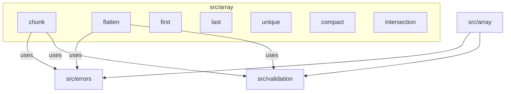

# C4 Code Level: src/array

## Overview

| Field | Value |
|-------|-------|
| **Name** | Array Utilities |
| **Description** | Collection of generic array manipulation functions |
| **Location** | [src/array/](../src/array/) |
| **Language** | TypeScript |
| **Purpose** | Provide common array operations (chunking, compacting, flattening, deduplication, intersection, element access) as reusable, type-safe utility functions |

## Code Elements

### Functions

#### `first<T>(arr: T[]): T | undefined`
- **File**: [src/array/first.ts:1](../src/array/first.ts)
- **Description**: Returns the first element of an array, or `undefined` if the array is empty.
- **Dependencies**: None

#### `last<T>(arr: T[]): T | undefined`
- **File**: [src/array/last.ts:1](../src/array/last.ts)
- **Description**: Returns the last element of an array, or `undefined` if the array is empty.
- **Dependencies**: None

#### `unique<T>(arr: T[]): T[]`
- **File**: [src/array/unique.ts:1](../src/array/unique.ts)
- **Description**: Returns a new array with duplicate values removed, preserving order of first occurrence. Uses `Set` for deduplication.
- **Dependencies**: None

#### `compact<T>(arr: T[]): T[]`
- **File**: [src/array/compact.ts:1](../src/array/compact.ts)
- **Description**: Returns a new array with all falsy values (`false`, `null`, `0`, `""`, `undefined`, `NaN`) removed. Uses `Array.filter(Boolean)`.
- **Dependencies**: None

#### `chunk<T>(arr: T[], size: number): T[][]`
- **File**: [src/array/chunk.ts:4](../src/array/chunk.ts)
- **Description**: Splits an array into groups of the specified size. The last chunk may contain fewer elements. Validates that `size` is a positive integer.
- **Parameters**:
  - `arr: T[]` - The array to split
  - `size: number` - The size of each chunk (must be a positive integer)
- **Throws**: `InvalidNumberError` if size is not a positive integer
- **Dependencies**:
  - `InvalidNumberError` from `../errors/index.js`
  - `isPositiveNumber` from `../validation/index.js`

#### `flatten(arr: any[], depth: number = 1): any[]`
- **File**: [src/array/flatten.ts:4](../src/array/flatten.ts)
- **Description**: Flattens a nested array to the specified depth. Supports `Infinity` for full flattening. Returns a shallow copy when depth is 0.
- **Parameters**:
  - `arr: any[]` - The nested array to flatten
  - `depth: number` - How deep to flatten (default: 1, supports Infinity)
- **Throws**: `InvalidNumberError` if depth is negative, NaN, or non-integer
- **Dependencies**:
  - `InvalidNumberError` from `../errors/index.js`
  - `isNonNegativeInteger` from `../validation/index.js`

#### `intersection<T>(...arrays: T[][]): T[]`
- **File**: [src/array/intersection.ts:1](../src/array/intersection.ts)
- **Description**: Returns elements common to all provided arrays. Deduplicates results. Preserves order from the first array. Returns empty array when no arrays provided or when any array is empty.
- **Parameters**:
  - `...arrays: T[][]` - Two or more arrays to intersect
- **Dependencies**: None

### Module Index

#### `src/array/index.ts`
- **File**: [src/array/index.ts](../src/array/index.ts)
- **Description**: Barrel export file that re-exports all array utility functions: `first`, `last`, `unique`, `chunk`, `compact`, `flatten`, `intersection`.

## Dependencies

### Internal Dependencies
- `src/errors/index.js` - Used by `chunk` and `flatten` for `InvalidNumberError`
- `src/validation/index.js` - Used by `chunk` for `isPositiveNumber` and by `flatten` for `isNonNegativeInteger`

### External Dependencies
- None (pure TypeScript, no external libraries)

## Relationships

