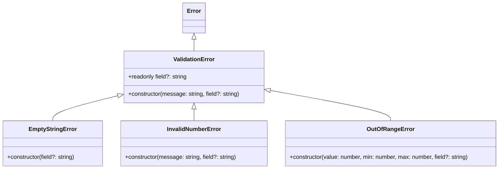

# C4 Code Level: src/errors

## Overview

| Field | Value |
|-------|-------|
| **Name** | Error Definitions |
| **Description** | Custom error class hierarchy for validation failures |
| **Location** | [src/errors/](../src/errors/) |
| **Language** | TypeScript |
| **Purpose** | Define a structured error hierarchy with typed error classes for validation failures, providing consistent error handling across the library |

## Code Elements

### Classes

#### `ValidationError extends Error`
- **File**: [src/errors/index.ts:1-6](../src/errors/index.ts)
- **Description**: Base error class for all validation-related errors. Extends the built-in `Error` class with an optional `field` property to identify which input caused the error.
- **Constructor**: `constructor(message: string, public readonly field?: string)`
- **Properties**:
  - `name: string` - Set to `'ValidationError'`
  - `field: string | undefined` - Optional field name that caused the error (readonly)
  - `message: string` - Human-readable error description (inherited from Error)
- **Dependencies**: None (extends built-in `Error`)

#### `EmptyStringError extends ValidationError`
- **File**: [src/errors/index.ts:8-13](../src/errors/index.ts)
- **Description**: Error thrown when an empty string is provided where a non-empty string is required. Uses a fixed message `'String cannot be empty'`.
- **Constructor**: `constructor(field?: string)`
- **Properties**:
  - `name: string` - Set to `'EmptyStringError'`
  - `message: string` - Always `'String cannot be empty'`
  - `field: string | undefined` - Optional field name (inherited)
- **Dependencies**: `ValidationError`

#### `InvalidNumberError extends ValidationError`
- **File**: [src/errors/index.ts:15-20](../src/errors/index.ts)
- **Description**: Error thrown when a number parameter fails validation (e.g., negative when positive required, non-integer when integer required).
- **Constructor**: `constructor(message: string, field?: string)`
- **Properties**:
  - `name: string` - Set to `'InvalidNumberError'`
  - `message: string` - Caller-specified validation message
  - `field: string | undefined` - Optional field name (inherited)
- **Dependencies**: `ValidationError`

#### `OutOfRangeError extends ValidationError`
- **File**: [src/errors/index.ts:22-27](../src/errors/index.ts)
- **Description**: Error thrown when a numeric value falls outside an expected range. Auto-formats the message as `'Value {value} is out of range [{min}, {max}]'`.
- **Constructor**: `constructor(value: number, min: number, max: number, field?: string)`
- **Properties**:
  - `name: string` - Set to `'OutOfRangeError'`
  - `message: string` - Auto-formatted range error message
  - `field: string | undefined` - Optional field name (inherited)
- **Dependencies**: `ValidationError`

## Dependencies

### Internal Dependencies
- None (this is a foundational module with no internal dependencies)

### External Dependencies
- None (extends built-in JavaScript `Error` class only)

## Relationships

