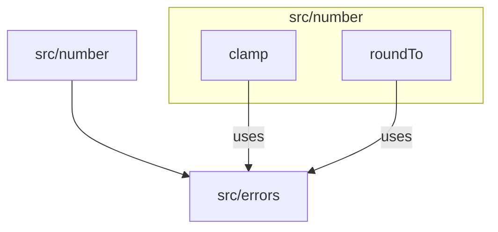

# C4 Code Level: src/number

## Overview

| Field | Value |
|-------|-------|
| **Name** | Number Utilities |
| **Description** | Collection of numeric manipulation and rounding functions |
| **Location** | [src/number/](../src/number/) |
| **Language** | TypeScript |
| **Purpose** | Provide common number operations (clamping to range, rounding to decimal places) as reusable utility functions with input validation |

## Code Elements

### Functions

#### `clamp(value: number, min: number, max: number): number`
- **File**: [src/number/clamp.ts:3](../src/number/clamp.ts)
- **Description**: Constrains a number to be within a specified range `[min, max]`. Returns `min` if value is below the range, `max` if above, or the value itself if within range.
- **Parameters**:
  - `value: number` - The number to clamp
  - `min: number` - The lower bound
  - `max: number` - The upper bound
- **Throws**: `OutOfRangeError` if `min > max`
- **Dependencies**:
  - `OutOfRangeError` from `../errors/index.js`

#### `roundTo(value: number, decimals: number): number`
- **File**: [src/number/roundTo.ts:3](../src/number/roundTo.ts)
- **Description**: Rounds a number to a specified number of decimal places using the multiply-round-divide technique (`Math.round(value * 10^decimals) / 10^decimals`).
- **Parameters**:
  - `value: number` - The number to round
  - `decimals: number` - Number of decimal places (must be a non-negative integer)
- **Throws**: `InvalidNumberError` if decimals is negative or not an integer
- **Dependencies**:
  - `InvalidNumberError` from `../errors/index.js`

### Module Index

#### `src/number/index.ts`
- **File**: [src/number/index.ts](../src/number/index.ts)
- **Description**: Barrel export file that re-exports all number utility functions: `clamp`, `roundTo`.

## Dependencies

### Internal Dependencies
- `src/errors/index.js` - Used by `clamp` for `OutOfRangeError` and by `roundTo` for `InvalidNumberError`

### External Dependencies
- None (pure TypeScript, no external libraries)

## Relationships

