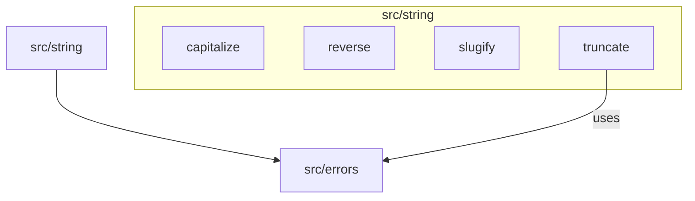

# C4 Code Level: src/string

## Overview

| Field | Value |
|-------|-------|
| **Name** | String Utilities |
| **Description** | Collection of string transformation and formatting functions |
| **Location** | [src/string/](../src/string/) |
| **Language** | TypeScript |
| **Purpose** | Provide common string operations (capitalization, reversal, slugification, truncation) as reusable utility functions |

## Code Elements

### Functions

#### `capitalize(str: string): string`
- **File**: [src/string/capitalize.ts:1](../src/string/capitalize.ts)
- **Description**: Capitalizes the first character of a string and lowercases the rest. Returns empty string unchanged.
- **Dependencies**: None

#### `reverse(str: string): string`
- **File**: [src/string/reverse.ts:1](../src/string/reverse.ts)
- **Description**: Reverses a string character by character. Uses spread operator to handle Unicode correctly.
- **Dependencies**: None

#### `slugify(str: string): string`
- **File**: [src/string/slugify.ts:1](../src/string/slugify.ts)
- **Description**: Converts a string to a URL-safe slug. Lowercases, replaces spaces with hyphens, removes special characters, collapses consecutive hyphens, and trims leading/trailing hyphens.
- **Dependencies**: None

#### `truncate(str: string, maxLength: number, suffix: string = '...'): string`
- **File**: [src/string/truncate.ts:3](../src/string/truncate.ts)
- **Description**: Truncates a string to a maximum length, appending a suffix (default `'...'`). Returns the string unchanged if it's already within the limit. Validates that maxLength is a positive integer and that suffix is non-empty.
- **Parameters**:
  - `str: string` - The string to truncate
  - `maxLength: number` - Maximum allowed length (must be a positive integer, at least as long as the suffix)
  - `suffix: string` - Suffix to append when truncating (default: `'...'`)
- **Throws**:
  - `EmptyStringError` if suffix is an empty string
  - `InvalidNumberError` if maxLength is not a positive integer or is less than suffix length
- **Dependencies**:
  - `EmptyStringError` from `../errors/index.js`
  - `InvalidNumberError` from `../errors/index.js`

### Module Index

#### `src/string/index.ts`
- **File**: [src/string/index.ts](../src/string/index.ts)
- **Description**: Barrel export file that re-exports all string utility functions: `reverse`, `truncate`, `slugify`, `capitalize`.

## Dependencies

### Internal Dependencies
- `src/errors/index.js` - Used by `truncate` for `EmptyStringError` and `InvalidNumberError`

### External Dependencies
- None (pure TypeScript, no external libraries)

## Relationships

