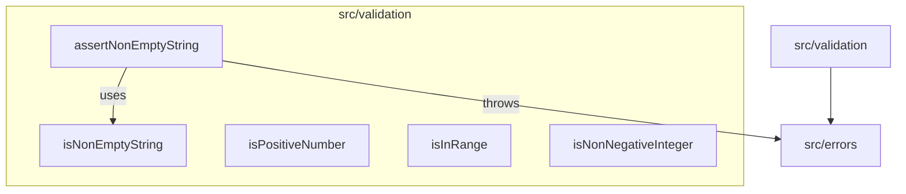

# C4 Code Level: src/validation

## Overview

| Field | Value |
|-------|-------|
| **Name** | Validation Utilities |
| **Description** | Type guard and assertion functions for runtime input validation |
| **Location** | [src/validation/](../src/validation/) |
| **Language** | TypeScript |
| **Purpose** | Provide type-safe validation functions (type guards and assertions) that narrow TypeScript types at runtime, used by other modules to validate inputs before processing |

## Code Elements

### Functions

#### `isNonEmptyString(value: unknown): value is string`
- **File**: [src/validation/index.ts:3-5](../src/validation/index.ts)
- **Description**: Type guard that checks if a value is a non-empty string. Returns `true` only for strings with `length > 0`. Narrows the type from `unknown` to `string`.
- **Dependencies**: None

#### `isPositiveNumber(value: unknown): value is number`
- **File**: [src/validation/index.ts:7-9](../src/validation/index.ts)
- **Description**: Type guard that checks if a value is a positive finite number. Returns `true` only for numbers that are finite and greater than 0. Narrows the type from `unknown` to `number`.
- **Dependencies**: None

#### `isInRange(value: number, min: number, max: number): boolean`
- **File**: [src/validation/index.ts:11-13](../src/validation/index.ts)
- **Description**: Checks if a number falls within a specified inclusive range `[min, max]`.
- **Parameters**:
  - `value: number` - The number to check
  - `min: number` - Lower bound (inclusive)
  - `max: number` - Upper bound (inclusive)
- **Dependencies**: None

#### `isNonNegativeInteger(value: unknown): value is number`
- **File**: [src/validation/index.ts:15-19](../src/validation/index.ts)
- **Description**: Type guard that checks if a value is a non-negative integer (>= 0). Returns `true` only for finite integers that are 0 or greater. Narrows the type from `unknown` to `number`.
- **Dependencies**: None

#### `assertNonEmptyString(value: unknown, field?: string): asserts value is string`
- **File**: [src/validation/index.ts:22-26](../src/validation/index.ts)
- **Description**: Assertion function that throws if the value is not a non-empty string. Uses `isNonEmptyString` internally. On success, narrows the type to `string` via TypeScript assertion signature.
- **Parameters**:
  - `value: unknown` - The value to validate
  - `field?: string` - Optional field name for the error message
- **Throws**: `EmptyStringError` if value is not a non-empty string
- **Dependencies**:
  - `EmptyStringError` from `../errors/index.js`
  - `isNonEmptyString` (internal function)

## Dependencies

### Internal Dependencies
- `src/errors/index.js` - Used by `assertNonEmptyString` for `EmptyStringError`

### External Dependencies
- None (pure TypeScript, no external libraries)

## Relationships

