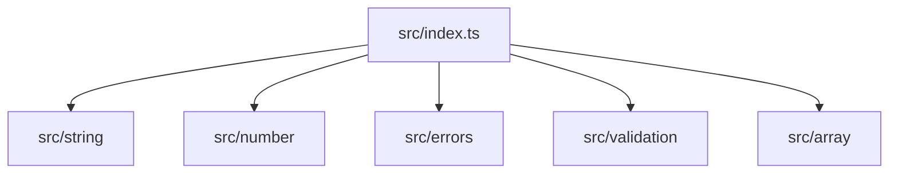

# C4 Code Level: src (Root)

## Overview

| Field | Value |
|-------|-------|
| **Name** | Library Entry Point |
| **Description** | Main barrel export that re-exports all library modules |
| **Location** | [src/](../src/) |
| **Language** | TypeScript |
| **Purpose** | Serve as the single entry point for the library, re-exporting all public functions and classes from submodules so consumers can import from a single path |

## Code Elements

### Module Index

#### `src/index.ts`
- **File**: [src/index.ts](../src/index.ts)
- **Description**: Root barrel export file. Re-exports all public APIs from the five submodules:
  - `export * from './string/index.js'` - All string utilities
  - `export * from './number/index.js'` - All number utilities
  - `export * from './errors/index.js'` - All error classes
  - `export * from './validation/index.js'` - All validation functions
  - `export * from './array/index.js'` - All array utilities

### Exported API Surface

Through transitive exports, `src/index.ts` exposes:

| Export | Type | Source Module |
|--------|------|---------------|
| `capitalize` | Function | string |
| `reverse` | Function | string |
| `slugify` | Function | string |
| `truncate` | Function | string |
| `clamp` | Function | number |
| `roundTo` | Function | number |
| `ValidationError` | Class | errors |
| `EmptyStringError` | Class | errors |
| `InvalidNumberError` | Class | errors |
| `OutOfRangeError` | Class | errors |
| `isNonEmptyString` | Function | validation |
| `isPositiveNumber` | Function | validation |
| `isInRange` | Function | validation |
| `isNonNegativeInteger` | Function | validation |
| `assertNonEmptyString` | Function | validation |
| `first` | Function | array |
| `last` | Function | array |
| `unique` | Function | array |
| `chunk` | Function | array |
| `compact` | Function | array |
| `flatten` | Function | array |
| `intersection` | Function | array |

## Dependencies

### Internal Dependencies
- `src/string/index.js` - String utilities module
- `src/number/index.js` - Number utilities module
- `src/errors/index.js` - Error classes module
- `src/validation/index.js` - Validation utilities module
- `src/array/index.js` - Array utilities module

### External Dependencies
- None

## Relationships

