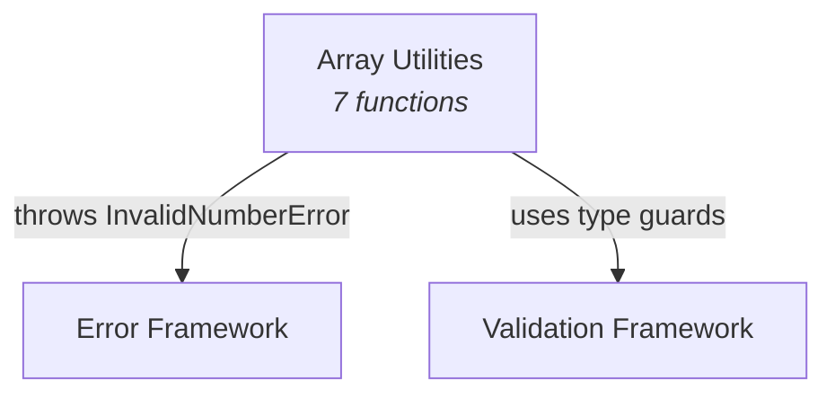

# C4 Component: Array Utilities

## Overview

| Field | Value |
|-------|-------|
| **Name** | Array Utilities |
| **Description** | Generic array manipulation functions for common operations |
| **Type** | Library Module |
| **Technology** | TypeScript (ES2022, ESM) |

## Purpose

The Array Utilities component provides a set of generic, type-safe functions for common array operations. It covers element access (first/last), transformation (chunk, flatten, compact), and set operations (unique, intersection). All functions are generic (`<T>`) to preserve caller type information. Functions that accept numeric parameters perform validation using the Error Framework and Validation Framework components.

## Software Features

| Feature | Description |
|---------|-------------|
| Element Access | Retrieve first or last element of an array with type-safe undefined handling |
| Array Chunking | Split arrays into fixed-size groups |
| Array Flattening | Flatten nested arrays to configurable depth (including Infinity) |
| Falsy Value Removal | Remove all falsy values from an array |
| Deduplication | Remove duplicate values using Set-based equality |
| Set Intersection | Find elements common to multiple arrays |

## Code Elements

| Code-Level Doc | Description |
|----------------|-------------|
| [c4-code-src-array.md](c4-code-src-array.md) | Source implementation - 7 functions + barrel export |
| [c4-code-tests-array.md](c4-code-tests-array.md) | Test suite - 58 test cases covering all functions |

## Interfaces

### Public API (Module Exports)

| Function | Signature | Description |
|----------|-----------|-------------|
| `first` | `<T>(arr: T[]): T \| undefined` | Get first element |
| `last` | `<T>(arr: T[]): T \| undefined` | Get last element |
| `unique` | `<T>(arr: T[]): T[]` | Deduplicate array |
| `compact` | `<T>(arr: T[]): T[]` | Remove falsy values |
| `chunk` | `<T>(arr: T[], size: number): T[][]` | Split into chunks |
| `flatten` | `(arr: any[], depth?: number): any[]` | Flatten nested array |
| `intersection` | `<T>(...arrays: T[][]): T[]` | Find common elements |

## Dependencies

### Components Used
- **[Error Framework](c4-component-error-framework.md)** - `InvalidNumberError` thrown by `chunk` and `flatten`; `OutOfRangeError` available
- **[Validation Framework](c4-component-validation-framework.md)** - `isPositiveNumber` used by `chunk`; `isNonNegativeInteger` used by `flatten`

### External Systems
- None

## Component Diagram

