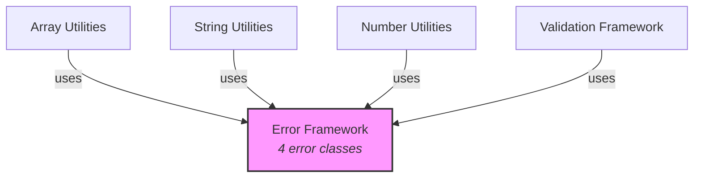

# C4 Component: Error Framework

## Overview

| Field | Value |
|-------|-------|
| **Name** | Error Framework |
| **Description** | Structured error class hierarchy for typed validation failures |
| **Type** | Library Module (Foundation) |
| **Technology** | TypeScript (ES2022, ESM) |

## Purpose

The Error Framework component provides a structured hierarchy of error classes that all other components use for consistent error handling. It defines a base `ValidationError` class extending the built-in `Error`, with specialized subclasses for specific failure modes: empty strings, invalid numbers, and out-of-range values. Each error carries an optional `field` property identifying which parameter caused the failure, enabling callers to handle errors programmatically.

This is a foundational component with no dependencies on other components.

## Software Features

| Feature | Description |
|---------|-------------|
| Typed Error Hierarchy | Structured inheritance tree enabling `instanceof` checks at any level |
| Field Identification | Optional `field` property on all errors to identify the failing parameter |
| Auto-formatted Messages | `OutOfRangeError` auto-generates human-readable range violation messages |
| Error Classification | Distinct error classes for distinct failure modes (empty string, invalid number, out of range) |

## Code Elements

| Code-Level Doc | Description |
|----------------|-------------|
| [c4-code-src-errors.md](c4-code-src-errors.md) | Source implementation - 4 error classes |
| [c4-code-tests-errors.md](c4-code-tests-errors.md) | Test suite - 13 test cases covering all classes |

## Interfaces

### Public API (Class Exports)

| Class | Extends | Constructor | Description |
|-------|---------|-------------|-------------|
| `ValidationError` | `Error` | `(message: string, field?: string)` | Base validation error |
| `EmptyStringError` | `ValidationError` | `(field?: string)` | Empty string violation |
| `InvalidNumberError` | `ValidationError` | `(message: string, field?: string)` | Invalid number parameter |
| `OutOfRangeError` | `ValidationError` | `(value: number, min: number, max: number, field?: string)` | Value outside range |

### Class Hierarchy

```
Error
  └── ValidationError (field?: string)
        ├── EmptyStringError
        ├── InvalidNumberError
        └── OutOfRangeError
```

## Dependencies

### Components Used
- None (foundational component)

### External Systems
- None (extends built-in JavaScript `Error`)

## Component Diagram


