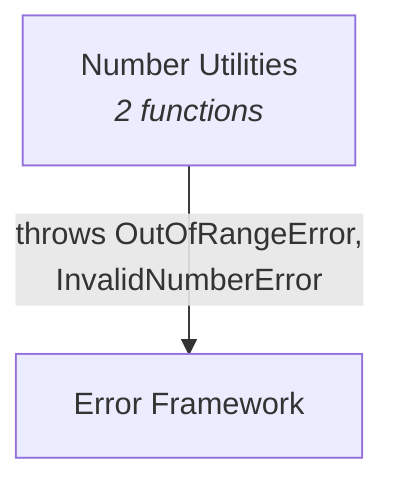

# C4 Component: Number Utilities

## Overview

| Field | Value |
|-------|-------|
| **Name** | Number Utilities |
| **Description** | Numeric manipulation and constraint functions |
| **Type** | Library Module |
| **Technology** | TypeScript (ES2022, ESM) |

## Purpose

The Number Utilities component provides functions for common numeric operations: constraining values to ranges (clamp) and rounding to specific decimal precision (roundTo). Both functions validate their inputs and throw typed errors from the Error Framework when invalid parameters are provided.

## Software Features

| Feature | Description |
|---------|-------------|
| Value Clamping | Constrain a number to be within a min/max range |
| Decimal Rounding | Round a number to a specific number of decimal places |

## Code Elements

| Code-Level Doc | Description |
|----------------|-------------|
| [c4-code-src-number.md](c4-code-src-number.md) | Source implementation - 2 functions + barrel export |
| [c4-code-tests-number.md](c4-code-tests-number.md) | Test suite - 12 test cases covering all functions |

## Interfaces

### Public API (Module Exports)

| Function | Signature | Description |
|----------|-----------|-------------|
| `clamp` | `(value: number, min: number, max: number): number` | Constrain value to range |
| `roundTo` | `(value: number, decimals: number): number` | Round to N decimal places |

## Dependencies

### Components Used
- **[Error Framework](c4-component-error-framework.md)** - `OutOfRangeError` thrown by `clamp`; `InvalidNumberError` thrown by `roundTo`

### External Systems
- None

## Component Diagram

