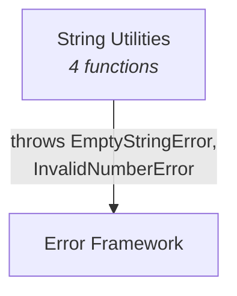

# C4 Component: String Utilities

## Overview

| Field | Value |
|-------|-------|
| **Name** | String Utilities |
| **Description** | String transformation and formatting functions |
| **Type** | Library Module |
| **Technology** | TypeScript (ES2022, ESM) |

## Purpose

The String Utilities component provides a set of functions for common string manipulation tasks. It handles text formatting (capitalize), content transformation (reverse, slugify), and length management (truncate). The `truncate` function performs parameter validation using the Error Framework. All functions handle edge cases like empty strings and support Unicode characters.

## Software Features

| Feature | Description |
|---------|-------------|
| Capitalization | Capitalize first character and lowercase the rest |
| String Reversal | Reverse string characters with Unicode awareness |
| URL Slugification | Convert strings to URL-safe slug format |
| String Truncation | Truncate strings with configurable suffix and length validation |

## Code Elements

| Code-Level Doc | Description |
|----------------|-------------|
| [c4-code-src-string.md](c4-code-src-string.md) | Source implementation - 4 functions + barrel export |
| [c4-code-tests-string.md](c4-code-tests-string.md) | Test suite - 20 test cases covering all functions |

## Interfaces

### Public API (Module Exports)

| Function | Signature | Description |
|----------|-----------|-------------|
| `capitalize` | `(str: string): string` | Capitalize first char, lowercase rest |
| `reverse` | `(str: string): string` | Reverse string characters |
| `slugify` | `(str: string): string` | Convert to URL-safe slug |
| `truncate` | `(str: string, maxLength: number, suffix?: string): string` | Truncate with suffix |

## Dependencies

### Components Used
- **[Error Framework](c4-component-error-framework.md)** - `EmptyStringError` and `InvalidNumberError` thrown by `truncate`

### External Systems
- None

## Component Diagram

