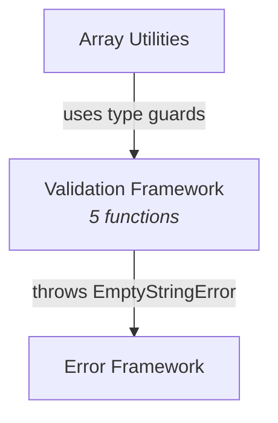

# C4 Component: Validation Framework

## Overview

| Field | Value |
|-------|-------|
| **Name** | Validation Framework |
| **Description** | Type guard and assertion functions for runtime input validation |
| **Type** | Library Module (Foundation) |
| **Technology** | TypeScript (ES2022, ESM) |

## Purpose

The Validation Framework component provides a set of type guard functions and assertion functions that perform runtime validation while also narrowing TypeScript types. Type guards return boolean values and can be used in `if` conditions to narrow `unknown` to specific types. The assertion function throws on invalid input and uses TypeScript's `asserts` keyword to narrow types after the call succeeds. This component is used internally by Array Utilities (for parameter validation) and is also exported for direct consumer use.

## Software Features

| Feature | Description |
|---------|-------------|
| String Validation | Type guard for non-empty strings with TypeScript narrowing |
| Positive Number Validation | Type guard for positive, finite numbers with TypeScript narrowing |
| Range Checking | Boolean check for numeric value within inclusive bounds |
| Non-negative Integer Validation | Type guard for integers >= 0 with TypeScript narrowing |
| String Assertion | Assertion function that throws on invalid input with field-level error detail |

## Code Elements

| Code-Level Doc | Description |
|----------------|-------------|
| [c4-code-src-validation.md](c4-code-src-validation.md) | Source implementation - 5 functions |
| [c4-code-tests-validation.md](c4-code-tests-validation.md) | Test suite - 22 test cases covering all functions |

## Interfaces

### Public API (Function Exports)

| Function | Signature | Description |
|----------|-----------|-------------|
| `isNonEmptyString` | `(value: unknown): value is string` | Type guard: non-empty string |
| `isPositiveNumber` | `(value: unknown): value is number` | Type guard: positive finite number |
| `isInRange` | `(value: number, min: number, max: number): boolean` | Range check |
| `isNonNegativeInteger` | `(value: unknown): value is number` | Type guard: integer >= 0 |
| `assertNonEmptyString` | `(value: unknown, field?: string): asserts value is string` | Assert non-empty string or throw |

## Dependencies

### Components Used
- **[Error Framework](c4-component-error-framework.md)** - `EmptyStringError` thrown by `assertNonEmptyString`

### External Systems
- None

## Component Diagram

