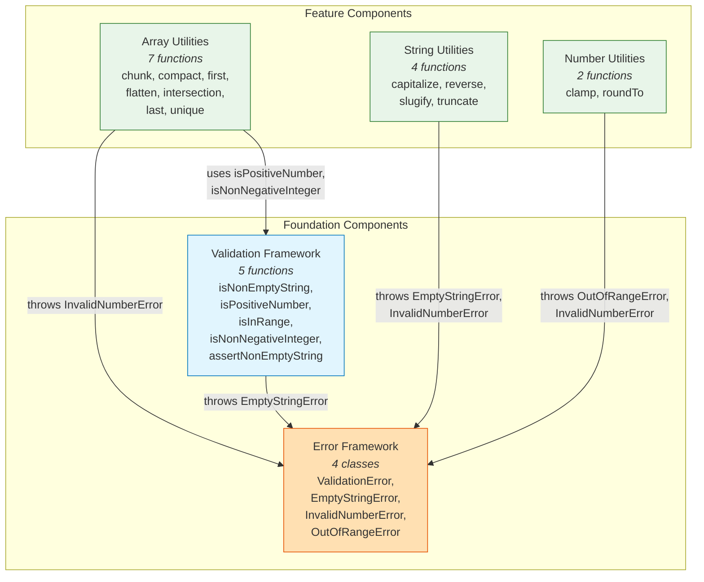

# C4 Component Level: Master Index

## System Components

| Component | Type | Description | Documentation |
|-----------|------|-------------|---------------|
| **Array Utilities** | Library Module | 7 generic array manipulation functions (chunk, compact, first, flatten, intersection, last, unique) | [c4-component-array-utilities.md](c4-component-array-utilities.md) |
| **String Utilities** | Library Module | 4 string transformation functions (capitalize, reverse, slugify, truncate) | [c4-component-string-utilities.md](c4-component-string-utilities.md) |
| **Number Utilities** | Library Module | 2 numeric manipulation functions (clamp, roundTo) | [c4-component-number-utilities.md](c4-component-number-utilities.md) |
| **Error Framework** | Foundation Module | 4-class error hierarchy for typed validation failures | [c4-component-error-framework.md](c4-component-error-framework.md) |
| **Validation Framework** | Foundation Module | 5 type guard and assertion functions for runtime input validation | [c4-component-validation-framework.md](c4-component-validation-framework.md) |

## Component Statistics

| Metric | Value |
|--------|-------|
| Total Components | 5 |
| Total Public Functions | 20 |
| Total Public Classes | 4 |
| Total Test Cases | ~126 |
| Foundation Components | 2 (Error Framework, Validation Framework) |
| Feature Components | 3 (Array, String, Number Utilities) |

## Component Relationships Diagram

## Dependency Summary

| Component | Depends On | Depended By |
|-----------|-----------|-------------|
| Error Framework | (none) | Array Utilities, String Utilities, Number Utilities, Validation Framework |
| Validation Framework | Error Framework | Array Utilities |
| Array Utilities | Error Framework, Validation Framework | (none - leaf) |
| String Utilities | Error Framework | (none - leaf) |
| Number Utilities | Error Framework | (none - leaf) |

## Code-Level Documentation Index

| Code Doc | Component |
|----------|-----------|
| [c4-code-src-array.md](c4-code-src-array.md) | Array Utilities |
| [c4-code-src-string.md](c4-code-src-string.md) | String Utilities |
| [c4-code-src-number.md](c4-code-src-number.md) | Number Utilities |
| [c4-code-src-errors.md](c4-code-src-errors.md) | Error Framework |
| [c4-code-src-validation.md](c4-code-src-validation.md) | Validation Framework |
| [c4-code-src.md](c4-code-src.md) | Library Entry Point (barrel export) |
| [c4-code-tests-array.md](c4-code-tests-array.md) | Array Utilities (tests) |
| [c4-code-tests-string.md](c4-code-tests-string.md) | String Utilities (tests) |
| [c4-code-tests-number.md](c4-code-tests-number.md) | Number Utilities (tests) |
| [c4-code-tests-errors.md](c4-code-tests-errors.md) | Error Framework (tests) |
| [c4-code-tests-validation.md](c4-code-tests-validation.md) | Validation Framework (tests) |
| [c4-code-tests.md](c4-code-tests.md) | Test Suite Root |
