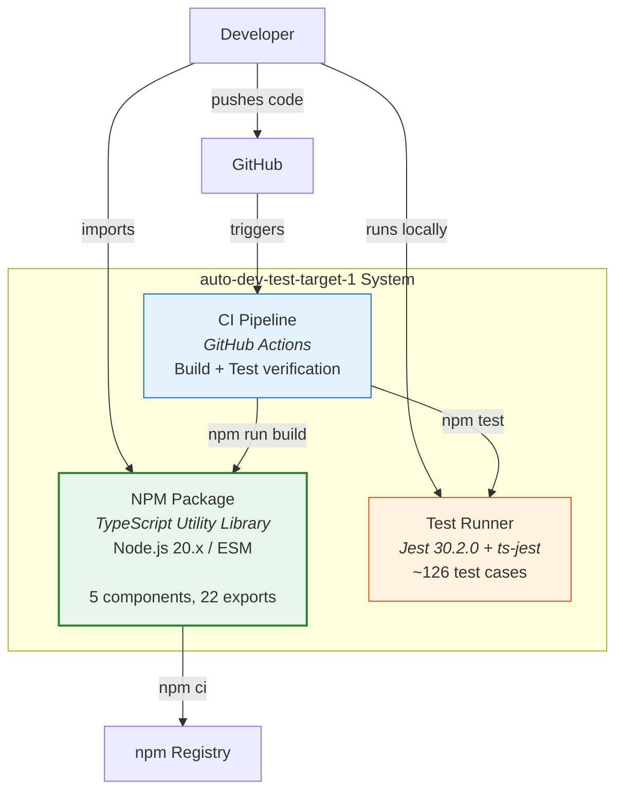

# C4 Container Level: auto-dev-test-target-1

## Containers

### 1. NPM Package (auto-dev-test-target-1)

| Field | Value |
|-------|-------|
| **Name** | auto-dev-test-target-1 |
| **Description** | TypeScript utility library distributed as an npm package |
| **Type** | Library / npm Package |
| **Technology** | TypeScript 5.3, Node.js 20.x (ESM) |
| **Deployment** | npm package (local/registry), compiled with `tsc` to `dist/` |

#### Purpose

This is the primary deployable artifact of the system. The TypeScript source in `src/` is compiled to JavaScript with declaration files into `dist/`, producing an npm-compatible package. Consumers import from the package entry point (`dist/index.js` with `dist/index.d.ts` types) to access all 22 public exports (functions and classes).

The package uses ES Modules (`"type": "module"`) and targets ES2022, requiring Node.js 20.x or compatible bundler environments.

#### Components

| Component | Description |
|-----------|-------------|
| [Array Utilities](c4-component-array-utilities.md) | 7 array manipulation functions |
| [String Utilities](c4-component-string-utilities.md) | 4 string transformation functions |
| [Number Utilities](c4-component-number-utilities.md) | 2 numeric manipulation functions |
| [Error Framework](c4-component-error-framework.md) | 4 typed error classes |
| [Validation Framework](c4-component-validation-framework.md) | 5 type guard/assertion functions |

#### Interfaces

##### Package API (npm import)

| Export | Type | Module |
|--------|------|--------|
| `first`, `last`, `unique`, `compact`, `chunk`, `flatten`, `intersection` | Functions | array |
| `capitalize`, `reverse`, `slugify`, `truncate` | Functions | string |
| `clamp`, `roundTo` | Functions | number |
| `ValidationError`, `EmptyStringError`, `InvalidNumberError`, `OutOfRangeError` | Classes | errors |
| `isNonEmptyString`, `isPositiveNumber`, `isInRange`, `isNonNegativeInteger`, `assertNonEmptyString` | Functions | validation |

**Import pattern:**
```typescript
import { chunk, capitalize, clamp, ValidationError } from 'auto-dev-test-target-1';
```

#### Package Configuration

| Field | Value |
|-------|-------|
| **Entry point** | `dist/index.js` |
| **Type declarations** | `dist/index.d.ts` |
| **Module system** | ESM (`"type": "module"`) |
| **TypeScript target** | ES2022 |
| **Module resolution** | NodeNext |
| **Strict mode** | Enabled |

#### Build Process

```bash
npm run build    # tsc → compiles src/ to dist/
```

**Input**: `src/**/*.ts` (19 TypeScript files)
**Output**: `dist/**/*.js` + `dist/**/*.d.ts` (compiled JavaScript + type declarations)

---

### 2. CI/CD Pipeline (GitHub Actions)

| Field | Value |
|-------|-------|
| **Name** | CI Pipeline |
| **Description** | Automated build and test verification on push and PR |
| **Type** | CI/CD Pipeline |
| **Technology** | GitHub Actions |
| **Deployment** | GitHub-hosted runner (ubuntu-latest) |

#### Purpose

The CI pipeline runs on every push to `main` and every pull request targeting `main`. It verifies that the code compiles without errors and all tests pass. This is the quality gate that protects the main branch.

#### Pipeline Steps

| Step | Command | Purpose |
|------|---------|---------|
| Checkout | `actions/checkout@v4` | Clone repository |
| Setup Node | `actions/setup-node@v4` (Node 20, npm cache) | Configure runtime |
| Install | `npm ci` | Install locked dependencies |
| Build | `npm run build` | Compile TypeScript |
| Test | `npm test` | Run Jest test suite |

#### Configuration

- **File**: [.github/workflows/ci.yml](../.github/workflows/ci.yml)
- **Triggers**: `push` to main, `pull_request` to main
- **Environment**: Ubuntu latest, Node.js 20

---

### 3. Test Runner (Jest)

| Field | Value |
|-------|-------|
| **Name** | Test Runner |
| **Description** | Jest test suite with ts-jest for TypeScript ESM support |
| **Type** | Development Tool |
| **Technology** | Jest 30.2.0, ts-jest 29.4.6 |
| **Deployment** | Local development, CI pipeline |

#### Purpose

The test runner executes ~126 test cases across all components to verify correctness. It uses ts-jest with ESM preset to run TypeScript tests directly without a separate compilation step. Tests mirror the source directory structure.

#### Configuration

- **Config file**: [jest.config.js](../jest.config.js)
- **Preset**: `ts-jest/presets/default-esm`
- **Test pattern**: `**/tests/**/*.test.ts`
- **Module mapping**: `.js` extensions remapped to `.ts` sources

#### Run Command

```bash
npm test    # jest
```

## Dependencies

### External Systems

| System | Type | Used By | Purpose |
|--------|------|---------|---------|
| npm Registry | Package Registry | NPM Package | Dependency resolution (`npm ci`) |
| GitHub | Source Control + CI | CI Pipeline | Code hosting, Actions runner |
| Node.js Runtime | Runtime Environment | All | JavaScript execution environment |

## Container Diagram


