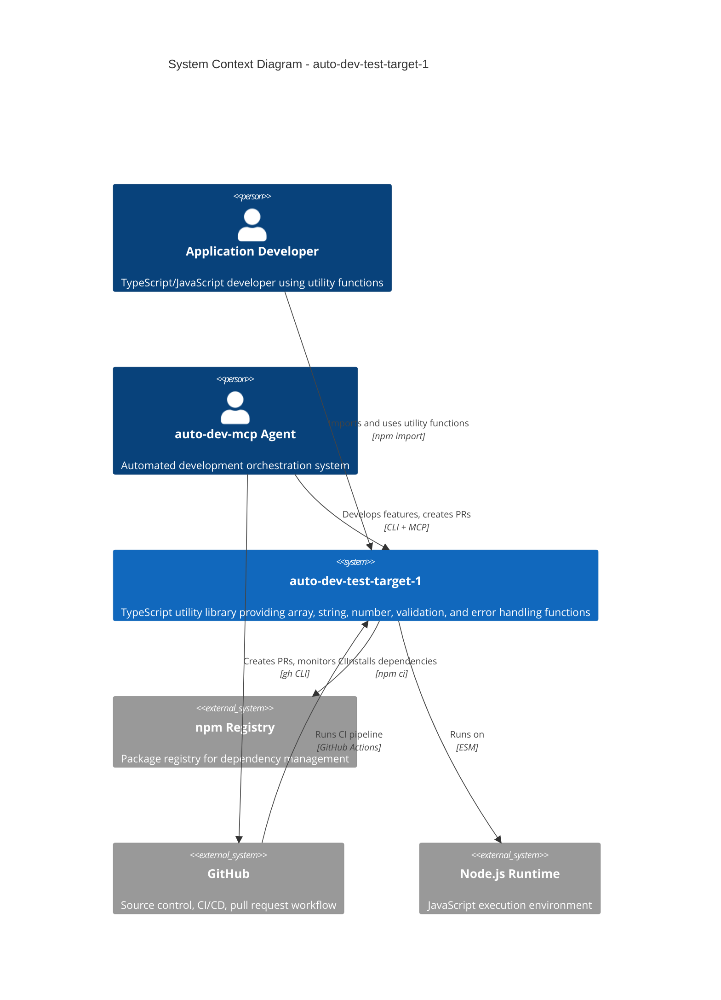

# C4 Context Level: auto-dev-test-target-1

## System Overview

**Short Description**: A minimal TypeScript utility library providing common array, string, number, validation, and error handling functions.

**Long Description**: auto-dev-test-target-1 is a TypeScript utility library that provides a curated set of functions for everyday programming tasks. It offers array manipulation (chunking, flattening, deduplication, intersection, element access), string transformation (capitalization, reversal, slugification, truncation), number operations (clamping, rounding), input validation (type guards, assertions), and a structured error hierarchy. The library is designed with type safety as a priority - all functions leverage TypeScript generics and type narrowing to provide compile-time guarantees. It is distributed as an ESM npm package targeting Node.js 20.x. The project also serves as a test target for auto-dev-mcp integration testing.

## Personas

### 1. Application Developer (Human User)

| Field | Value |
|-------|-------|
| **Type** | Human User |
| **Description** | A TypeScript/JavaScript developer building applications who needs utility functions without pulling in large libraries like lodash |
| **Goals** | Import and use type-safe utility functions to manipulate arrays, strings, and numbers with minimal overhead |
| **Key Features Used** | Array Utilities, String Utilities, Number Utilities, Validation Framework |

### 2. Library Consumer (Programmatic User)

| Field | Value |
|-------|-------|
| **Type** | Programmatic User |
| **Description** | Other npm packages or applications that import this library as a dependency |
| **Goals** | Depend on a lightweight, well-typed utility library with zero transitive dependencies |
| **Key Features Used** | Full API surface via package import |

### 3. auto-dev-mcp Agent (Programmatic User)

| Field | Value |
|-------|-------|
| **Type** | Programmatic User / External System |
| **Description** | The auto-dev-mcp orchestration system that uses this project as a test target for automated development workflows |
| **Goals** | Execute automated feature development, testing, and PR workflows against this codebase |
| **Key Features Used** | Full codebase (source, tests, CI pipeline) |

### 4. CI System (External System)

| Field | Value |
|-------|-------|
| **Type** | External System |
| **Description** | GitHub Actions CI pipeline that builds and tests the project on every push and PR |
| **Goals** | Verify code quality by compiling TypeScript and running the full test suite |
| **Key Features Used** | Build process, Test suite |

## System Features

| Feature | Description | Personas |
|---------|-------------|----------|
| **Array Manipulation** | Chunk, compact, flatten, unique, intersection, first/last element access | Application Developer, Library Consumer |
| **String Transformation** | Capitalize, reverse, slugify, truncate strings | Application Developer, Library Consumer |
| **Number Operations** | Clamp values to ranges, round to decimal precision | Application Developer, Library Consumer |
| **Input Validation** | Type guards (isNonEmptyString, isPositiveNumber, etc.) and assertion functions | Application Developer, Library Consumer |
| **Typed Error Handling** | Structured error hierarchy with field-level error identification | Application Developer, Library Consumer |
| **Automated CI/CD** | Build and test verification on every commit | CI System, auto-dev-mcp Agent |

## User Journeys

### Array Manipulation - Application Developer Journey

1. **Install**: Developer adds `auto-dev-test-target-1` to their project via `npm install`
2. **Import**: Developer imports specific functions: `import { chunk, unique } from 'auto-dev-test-target-1'`
3. **Use**: Developer calls functions with type-safe parameters, IDE provides autocomplete and type checking
4. **Handle Errors**: If invalid parameters are passed (e.g., negative chunk size), catch typed `InvalidNumberError` with field identification
5. **Benefit**: Generic types are preserved - `chunk<number>` returns `number[][]`, no manual casting needed

### String Transformation - Application Developer Journey

1. **Import**: `import { slugify, truncate } from 'auto-dev-test-target-1'`
2. **Slugify**: Convert user-generated titles to URL-safe slugs for routing
3. **Truncate**: Truncate long text for UI display with configurable suffix
4. **Handle Errors**: Catch `EmptyStringError` or `InvalidNumberError` if parameters are invalid
5. **Benefit**: Unicode-aware operations, consistent behavior across edge cases

### Input Validation - Application Developer Journey

1. **Import**: `import { isPositiveNumber, assertNonEmptyString } from 'auto-dev-test-target-1'`
2. **Guard**: Use type guards in conditionals: `if (isPositiveNumber(input)) { /* input is narrowed to number */ }`
3. **Assert**: Use assertion functions at boundaries: `assertNonEmptyString(name, 'name')` throws typed error on failure
4. **Benefit**: TypeScript compiler narrows types after guards/assertions, eliminating manual type casts

### Library Integration - Library Consumer Journey

1. **Add Dependency**: `npm install auto-dev-test-target-1`
2. **Configure**: No configuration needed - works with ESM and NodeNext module resolution
3. **Import**: Import any of the 22 public exports from the single entry point
4. **Use**: All functions are pure (no side effects, no state), safe for any context
5. **Benefit**: Zero transitive dependencies, small bundle size, full type declarations included

### Automated Development - auto-dev-mcp Agent Journey

1. **Receive Feature Spec**: MCP server provides requirements and implementation plan
2. **Read Design Docs**: Read documents from `comms/inbox/`
3. **Implement**: Write code in `src/` and tests in `tests/`
4. **Quality Check**: Run `npm run build` and `npm test` locally
5. **Create PR**: Push branch and create pull request via `gh`
6. **CI Verification**: GitHub Actions runs build + test
7. **Fix & Iterate**: Fix CI failures (up to 3 attempts)
8. **Merge**: Squash merge when CI passes
9. **Report**: Write completion report to `comms/outbox/`

## External Systems and Dependencies

| System | Type | Integration | Purpose |
|--------|------|-------------|---------|
| **npm Registry** | Package Registry | npm CLI | Dependency installation (`npm ci`) and potential package publishing |
| **GitHub** | Source Control + CI Platform | git + GitHub Actions | Code hosting, pull request workflow, CI pipeline execution |
| **Node.js Runtime** | Runtime Environment | Direct execution | JavaScript runtime for the compiled library and test execution |
| **auto-dev-mcp** | Development Orchestration | CLI + MCP Protocol | Automated feature development and testing against this project |

## System Context Diagram

## Related Documentation

- **Container Level**: [c4-container.md](c4-container.md) - Deployment containers and CI pipeline
- **Component Level**: [c4-component.md](c4-component.md) - Master component index with all 5 components
- **Code Level**: See individual `c4-code-*.md` files for function-level documentation
