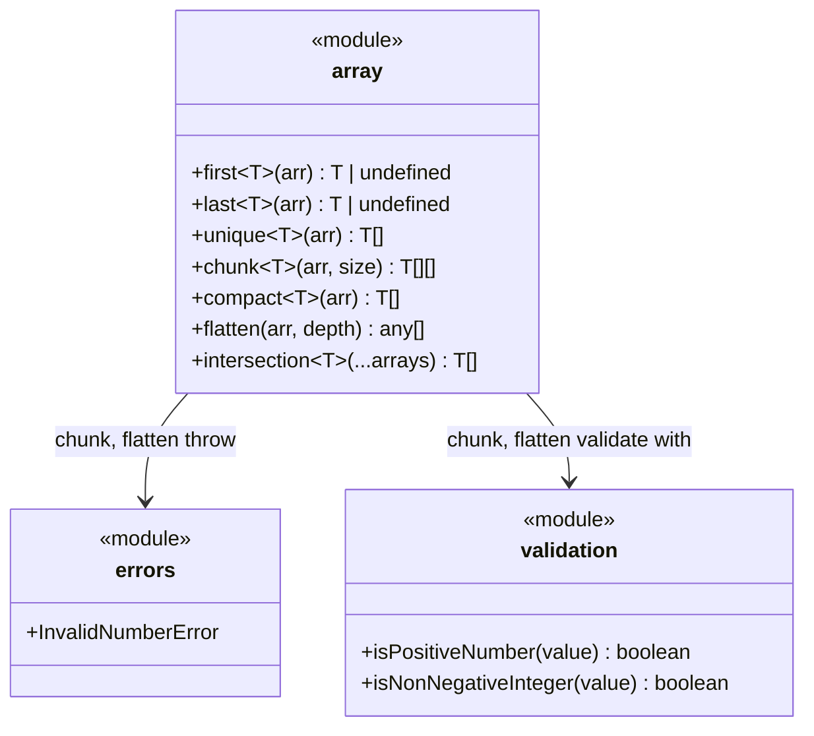

# C4 Code Level: Array Utilities

## Overview
- **Name**: Array Utilities
- **Description**: A collection of generic array manipulation functions for common operations like chunking, filtering, flattening, and element access.
- **Location**: src/array
- **Language**: TypeScript
- **Purpose**: Provides reusable, type-safe array utility functions with input validation and error handling.

## Code Elements

### Functions/Methods

- `first<T>(arr: T[]): T | undefined`
  - Description: Returns the first element of an array, or undefined if the array is empty.
  - Location: src/array/first.ts:1
  - Dependencies: None

- `last<T>(arr: T[]): T | undefined`
  - Description: Returns the last element of an array, or undefined if the array is empty.
  - Location: src/array/last.ts:1
  - Dependencies: None

- `unique<T>(arr: T[]): T[]`
  - Description: Returns a new array with duplicate values removed, preserving first-occurrence order. Uses `Set` for deduplication.
  - Location: src/array/unique.ts:1
  - Dependencies: None

- `chunk<T>(arr: T[], size: number): T[][]`
  - Description: Splits an array into sub-arrays of the specified size. The last chunk may contain fewer elements. Validates that size is a positive integer.
  - Location: src/array/chunk.ts:4
  - Dependencies: `InvalidNumberError` from `src/errors/index.ts`, `isPositiveNumber` from `src/validation/index.ts`

- `compact<T>(arr: T[]): T[]`
  - Description: Returns a new array with all falsy values removed (false, null, 0, "", undefined, NaN).
  - Location: src/array/compact.ts:1
  - Dependencies: None

- `flatten(arr: any[], depth: number = 1): any[]`
  - Description: Recursively flattens a nested array to the specified depth. Supports `Infinity` for full flattening. Validates depth is a non-negative integer (except Infinity).
  - Location: src/array/flatten.ts:4
  - Dependencies: `InvalidNumberError` from `src/errors/index.ts`, `isNonNegativeInteger` from `src/validation/index.ts`

- `intersection<T>(...arrays: T[][]): T[]`
  - Description: Returns elements common to all provided arrays. Results are deduplicated and preserve order from the first array. Uses strict equality.
  - Location: src/array/intersection.ts:1
  - Dependencies: None

### Modules

- `src/array/index.ts` (barrel export)
  - Description: Re-exports all array utility functions as the public API for the array module.
  - Location: src/array/index.ts
  - Exports: `first`, `last`, `unique`, `chunk`, `compact`, `flatten`, `intersection`

## Dependencies

### Internal Dependencies
- `src/errors/index.ts` — `InvalidNumberError` (used by `chunk`, `flatten`)
- `src/validation/index.ts` — `isPositiveNumber` (used by `chunk`), `isNonNegativeInteger` (used by `flatten`)

### External Dependencies
- None

## Relationships

