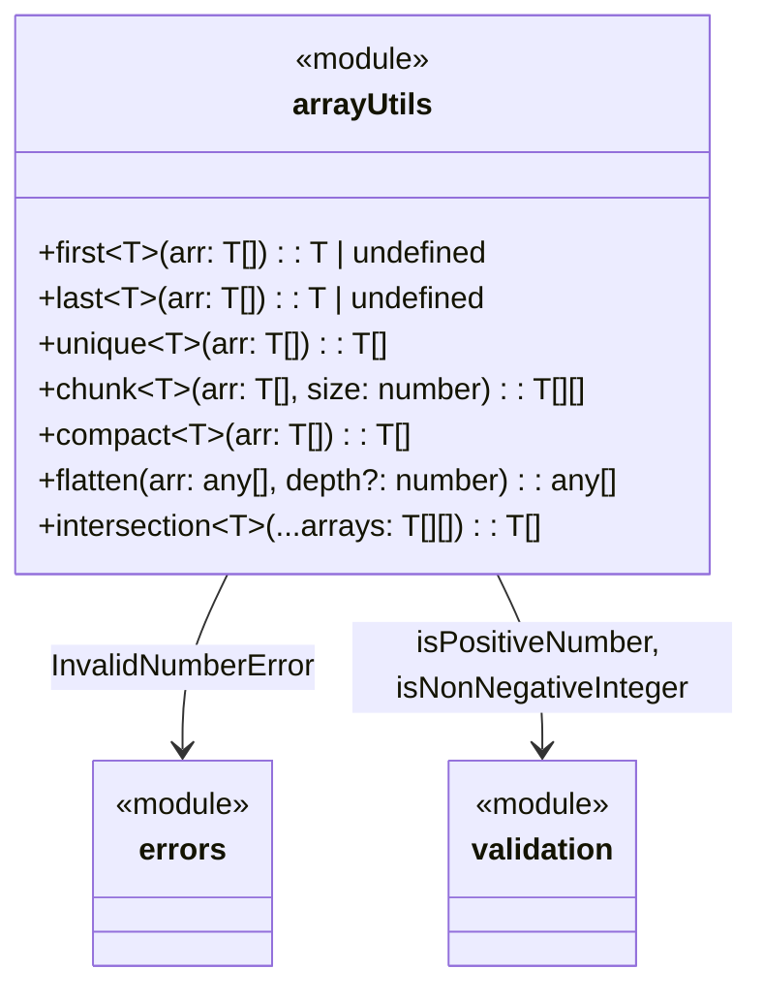

# C4 Code Level: Array Utilities

## Overview
- **Name**: Array Utilities
- **Description**: Collection of generic array manipulation functions
- **Location**: `src/array`
- **Language**: TypeScript
- **Purpose**: Provides commonly-needed array operations such as retrieving elements, deduplication, chunking, compacting, flattening, and computing intersections
- **Parent Component**: [Collection Utilities](c4-component-collections.md)

## Code Elements

### Functions/Methods

#### `src/array/first.ts`
- `first<T>(arr: T[]): T | undefined` — Returns the first element of the array, or undefined if empty

#### `src/array/last.ts`
- `last<T>(arr: T[]): T | undefined` — Returns the last element of the array, or undefined if empty

#### `src/array/unique.ts`
- `unique<T>(arr: T[]): T[]` — Returns a new array with duplicate values removed (via Set)

#### `src/array/chunk.ts`
- `chunk<T>(arr: T[], size: number): T[][]` — Splits an array into groups of the specified size. Throws `InvalidNumberError` if size is not a positive integer

#### `src/array/compact.ts`
- `compact<T>(arr: T[]): T[]` — Removes all falsy values (false, null, 0, "", undefined, NaN) from the array

#### `src/array/flatten.ts`
- `flatten(arr: any[], depth?: number): any[]` — Recursively flattens a nested array to the specified depth (default 1). Supports `Infinity`. Throws `InvalidNumberError` if depth is not a non-negative integer

#### `src/array/intersection.ts`
- `intersection<T>(...arrays: T[][]): T[]` — Returns an array of unique values present in all provided arrays

#### `src/array/index.ts` (barrel export)
- Re-exports: `first`, `last`, `unique`, `chunk`, `compact`, `flatten`, `intersection`

## Dependencies

### Internal Dependencies
- `src/errors/index.js` — `InvalidNumberError` (used by `chunk`, `flatten`)
- `src/validation/index.js` — `isPositiveNumber`, `isNonNegativeInteger` (used by `chunk`, `flatten`)

### External Dependencies
- None

## Relationships

```mermaid
classDiagram
    class arrayUtils {
        <<module>>
        +first~T~(arr: T[]): T | undefined
        +last~T~(arr: T[]): T | undefined
        +unique~T~(arr: T[]): T[]
        +chunk~T~(arr: T[], size: number): T[][]
        +compact~T~(arr: T[]): T[]
        +flatten(arr: any[], depth?: number): any[]
        +intersection~T~(...arrays: T[][]): T[]
    }
    class errors {
        <<module>>
    }
    class validation {
        <<module>>
    }
    arrayUtils --> errors : InvalidNumberError
    arrayUtils --> validation : isPositiveNumber, isNonNegativeInteger
```
