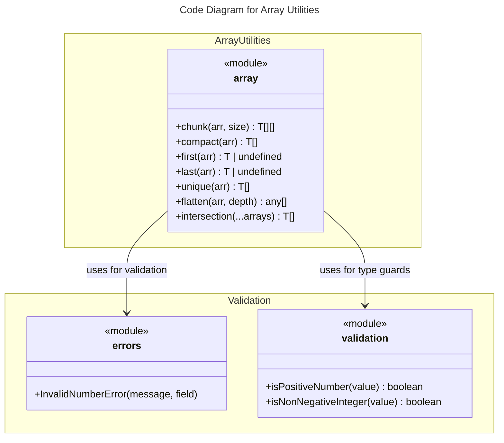

# C4 Code Level: Array Utilities

## Overview

- **Name**: Array Utilities Module
- **Description**: Pure functional array manipulation utilities providing common operations like chunking, filtering, set operations, and element access.
- **Location**: `src/array`
- **Language**: TypeScript 5.x (ESM)
- **Purpose**: Provides type-safe, utility functions for array transformations and operations
- **Parent Component**: [Array Utilities](./c4-component-array-utilities.md)

## Code Elements

### Functions/Methods

- `chunk<T>(arr: T[], size: number): T[][]`
  - Description: Splits an array into chunks of specified size
  - Location: `src/array/chunk.ts:4-18`
  - Dependencies: `InvalidNumberError`, `isPositiveNumber`
  - Throws: `InvalidNumberError` if size is not a positive integer

- `compact<T>(arr: T[]): T[]`
  - Description: Removes all falsy values (false, null, 0, "", undefined, NaN) from array
  - Location: `src/array/compact.ts:1-5`
  - Dependencies: None (uses native Array.filter)
  - Generic: Preserves element type while filtering falsy values

- `first<T>(arr: T[]): T | undefined`
  - Description: Returns the first element of an array or undefined if empty
  - Location: `src/array/first.ts:1-3`
  - Dependencies: None
  - Generic: Preserves array element type

- `last<T>(arr: T[]): T | undefined`
  - Description: Returns the last element of an array or undefined if empty
  - Location: `src/array/last.ts:1-3`
  - Dependencies: None
  - Generic: Preserves array element type

- `unique<T>(arr: T[]): T[]`
  - Description: Removes duplicate elements, preserving order of first occurrence
  - Location: `src/array/unique.ts:1-3`
  - Dependencies: None (uses native Set)
  - Note: Treats NaN as equal value (Set behavior)

- `flatten(arr: any[], depth: number = 1): any[]`
  - Description: Recursively flattens nested arrays to specified depth
  - Location: `src/array/flatten.ts:4-28`
  - Dependencies: `InvalidNumberError`, `isNonNegativeInteger`
  - Parameters: arr (array to flatten), depth (nesting levels, default 1, accepts Infinity)
  - Throws: `InvalidNumberError` if depth is negative or not an integer

- `intersection<T>(...arrays: T[][]): T[]`
  - Description: Returns elements present in all provided arrays, with no duplicates
  - Location: `src/array/intersection.ts:1-16`
  - Dependencies: None (uses native Set and Array.includes)
  - Variadic: Accepts 0 or more arrays
  - Deduplication: Automatically deduplicates results using Set

## Dependencies

### Internal Dependencies

- `src/errors/index.ts` - `InvalidNumberError` class for validation errors
- `src/validation/index.ts` - `isPositiveNumber`, `isNonNegativeInteger` type guards

### External Dependencies

- TypeScript 5.x - Type system and generic types
- ES2015+ - Native Set, Array.prototype methods (filter, slice, reduce, concat, includes)

## Relationships

```mermaid
---
title: Code Diagram for Array Utilities
---
classDiagram
    namespace ArrayUtilities {
        class array {
            <<module>>
            +chunk(arr, size) T[][]
            +compact(arr) T[]
            +first(arr) T | undefined
            +last(arr) T | undefined
            +unique(arr) T[]
            +flatten(arr, depth) any[]
            +intersection(...arrays) T[]
        }
    }

    namespace Validation {
        class errors {
            <<module>>
            +InvalidNumberError(message, field)
        }
        class validation {
            <<module>>
            +isPositiveNumber(value) boolean
            +isNonNegativeInteger(value) boolean
        }
    }

    array --> errors : uses for validation
    array --> validation : uses for type guards
```

## Test Coverage

- **Test Location**: `tests/array/`
- **Test Files**: 7 test files with 53 total test cases
  - `chunk.test.ts` - 10 test cases
  - `compact.test.ts` - 10 test cases
  - `first.test.ts` - 5 test cases
  - `last.test.ts` - 5 test cases
  - `unique.test.ts` - 8 test cases
  - `flatten.test.ts` - 13 test cases
  - `intersection.test.ts` - 10 test cases
- **Verified by execution**: Yes (all tests passing)
- **Coverage**: All public functions have comprehensive test coverage including edge cases, error conditions, and type preservation

## Export

- **Barrel Export**: `src/array/index.ts` exports all functions as named exports
- **Re-exported from**: `src/index.ts` (main package entry point)
