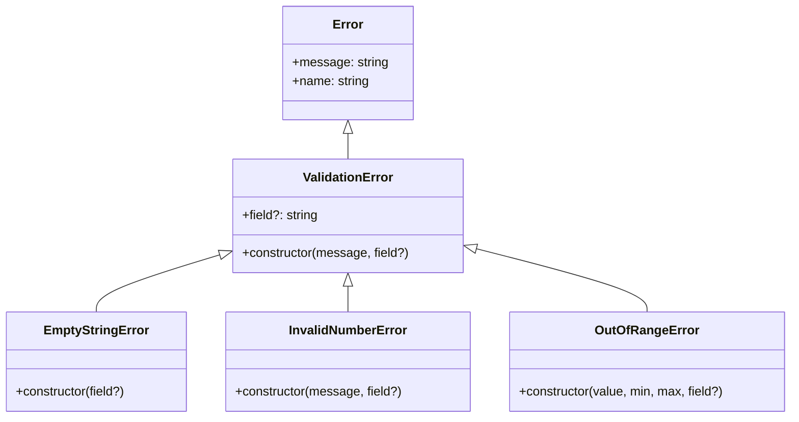

# C4 Code Level: Error Classes

## Overview
- **Name**: Error Classes
- **Description**: Custom error class hierarchy for structured validation error handling across the library.
- **Location**: src/errors
- **Language**: TypeScript
- **Purpose**: Provides a hierarchy of typed error classes extending the built-in Error, enabling callers to catch and distinguish between different validation failure types.

## Code Elements

### Classes/Modules

- `ValidationError`
  - Description: Base error class for all validation errors. Extends the native `Error` class and adds an optional `field` property identifying which input caused the error.
  - Location: src/errors/index.ts:1
  - Methods:
    - `constructor(message: string, field?: string)`
  - Properties:
    - `readonly field?: string`
    - `name: string` (set to `'ValidationError'`)
  - Dependencies: Built-in `Error`

- `EmptyStringError`
  - Description: Thrown when a string value is empty but a non-empty string is required. Uses a fixed message "String cannot be empty".
  - Location: src/errors/index.ts:8
  - Methods:
    - `constructor(field?: string)`
  - Dependencies: Extends `ValidationError`

- `InvalidNumberError`
  - Description: Thrown when a numeric value fails validation (e.g., not a positive integer, not a non-negative integer).
  - Location: src/errors/index.ts:15
  - Methods:
    - `constructor(message: string, field?: string)`
  - Dependencies: Extends `ValidationError`

- `OutOfRangeError`
  - Description: Thrown when a numeric value falls outside an expected range. Generates a message in the format "Value {value} is out of range [{min}, {max}]".
  - Location: src/errors/index.ts:22
  - Methods:
    - `constructor(value: number, min: number, max: number, field?: string)`
  - Dependencies: Extends `ValidationError`

## Dependencies

### Internal Dependencies
- None

### External Dependencies
- None (only extends built-in `Error`)

## Relationships

