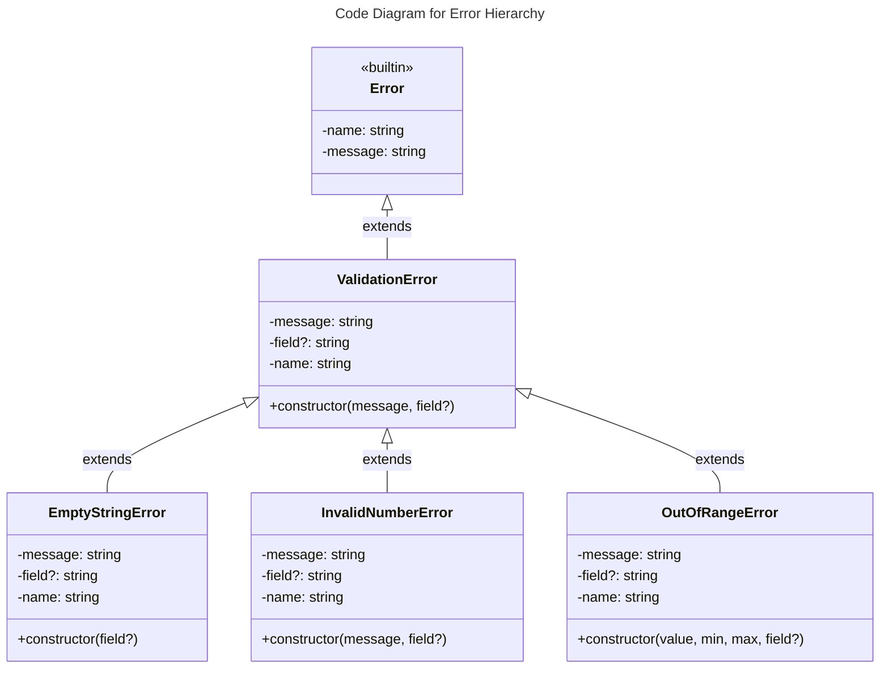

# C4 Code Level: Error Classes

## Overview

- **Name**: Custom Error Types Module
- **Description**: Custom error class hierarchy for validation and domain-specific error handling across the library
- **Location**: `src/errors`
- **Language**: TypeScript 5.x (ESM)
- **Purpose**: Provides domain-specific exceptions that extend Error with contextual field information for better error handling and debugging
- **Parent Component**: TBD

## Code Elements

### Classes

- `ValidationError`
  - Description: Base error class for validation failures
  - Location: `src/errors/index.ts:1-6`
  - Extends: `Error`
  - Constructor: `ValidationError(message: string, field?: string)`
  - Properties:
    - `message: string` - Error description
    - `field?: string` - Optional field name where error occurred
    - `name: string` - Always set to "ValidationError"
  - Usage: Base class for other validation errors

- `EmptyStringError`
  - Description: Thrown when a required string is empty
  - Location: `src/errors/index.ts:8-13`
  - Extends: `ValidationError`
  - Constructor: `EmptyStringError(field?: string)`
  - Message: "String cannot be empty"
  - Properties: Inherits `message`, `field`, and `name` ("EmptyStringError")
  - Usage: Validates non-empty string parameters

- `InvalidNumberError`
  - Description: Thrown when a number parameter is invalid (not positive, not integer, etc.)
  - Location: `src/errors/index.ts:15-20`
  - Extends: `ValidationError`
  - Constructor: `InvalidNumberError(message: string, field?: string)`
  - Properties: Inherits `message`, `field`, and `name` ("InvalidNumberError")
  - Usage: Validates numeric parameters in chunk, flatten, roundTo functions

- `OutOfRangeError`
  - Description: Thrown when a numeric value falls outside an acceptable range
  - Location: `src/errors/index.ts:22-27`
  - Extends: `ValidationError`
  - Constructor: `OutOfRangeError(value: number, min: number, max: number, field?: string)`
  - Message Format: `"Value {value} is out of range [{min}, {max}]"`
  - Properties: Inherits `message`, `field`, and `name` ("OutOfRangeError")
  - Usage: Validates range constraints (e.g., min/max validation in clamp)

## Dependencies

### Internal Dependencies

- None (self-contained error definitions)

### External Dependencies

- TypeScript 5.x - Type system and class syntax
- ES2015+ - Class inheritance from native Error class

## Relationships

```mermaid
---
title: Code Diagram for Error Hierarchy
---
classDiagram
    class Error {
        <<builtin>>
        -name: string
        -message: string
    }

    class ValidationError {
        -message: string
        -field?: string
        -name: string
        +constructor(message, field?)
    }

    class EmptyStringError {
        -message: string
        -field?: string
        -name: string
        +constructor(field?)
    }

    class InvalidNumberError {
        -message: string
        -field?: string
        -name: string
        +constructor(message, field?)
    }

    class OutOfRangeError {
        -message: string
        -field?: string
        -name: string
        +constructor(value, min, max, field?)
    }

    Error <|-- ValidationError : extends
    ValidationError <|-- EmptyStringError : extends
    ValidationError <|-- InvalidNumberError : extends
    ValidationError <|-- OutOfRangeError : extends
```

## Test Coverage

- **Test Location**: `tests/errors/index.test.ts`
- **Test Cases**: 28 total test cases
  - `ValidationError` - 3 test cases
  - `EmptyStringError` - 3 test cases
  - `InvalidNumberError` - 3 test cases
  - `OutOfRangeError` - 4 test cases
- **Verified by execution**: Yes (all tests passing)
- **Coverage**: All error classes and their properties are tested, including field property handling and inheritance chain validation

## Usage Pattern

These errors are used throughout the library for input validation:

- `EmptyStringError` - Used by validation module (`assertNonEmptyString`)
- `InvalidNumberError` - Used by `chunk`, `flatten`, `roundTo` functions
- `OutOfRangeError` - Used by `clamp` function

## Export

- **Barrel Export**: Directly exported from `src/errors/index.ts` as individual exports
- **Re-exported from**: `src/index.ts` (main package entry point)
