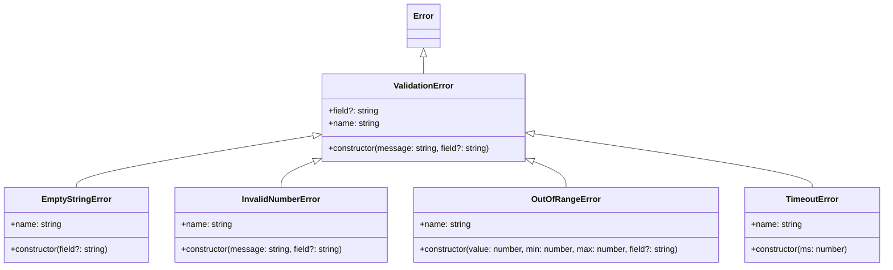

# C4 Code Level: Error Classes

## Overview
- **Name**: Error Classes
- **Description**: Custom error class hierarchy for validation and domain-specific errors
- **Location**: `src/errors`
- **Language**: TypeScript
- **Purpose**: Provides structured, typed error classes used throughout the library for input validation failures, out-of-range values, and timeout conditions
- **Parent Component**: [Core Infrastructure](c4-component-core.md)

## Code Elements

### Classes/Modules

#### `src/errors/index.ts`

- **`ValidationError`** extends `Error`
  - Constructor: `constructor(message: string, field?: string)`
  - Properties: `readonly field?: string`, `name: 'ValidationError'`
  - Base class for all custom errors in the library

- **`EmptyStringError`** extends `ValidationError`
  - Constructor: `constructor(field?: string)`
  - Hardcoded message: `'String cannot be empty'`
  - `name: 'EmptyStringError'`

- **`InvalidNumberError`** extends `ValidationError`
  - Constructor: `constructor(message: string, field?: string)`
  - `name: 'InvalidNumberError'`

- **`OutOfRangeError`** extends `ValidationError`
  - Constructor: `constructor(value: number, min: number, max: number, field?: string)`
  - Message format: `Value ${value} is out of range [${min}, ${max}]`
  - `name: 'OutOfRangeError'`

- **`TimeoutError`** extends `ValidationError`
  - Constructor: `constructor(ms: number)`
  - Message format: `Operation timed out after ${ms}ms`
  - `name: 'TimeoutError'`

## Dependencies

### Internal Dependencies
- None

### External Dependencies
- None

## Relationships

```mermaid
classDiagram
    class ValidationError {
        +field?: string
        +name: string
        +constructor(message: string, field?: string)
    }
    class EmptyStringError {
        +name: string
        +constructor(field?: string)
    }
    class InvalidNumberError {
        +name: string
        +constructor(message: string, field?: string)
    }
    class OutOfRangeError {
        +name: string
        +constructor(value: number, min: number, max: number, field?: string)
    }
    class TimeoutError {
        +name: string
        +constructor(ms: number)
    }
    Error <|-- ValidationError
    ValidationError <|-- EmptyStringError
    ValidationError <|-- InvalidNumberError
    ValidationError <|-- OutOfRangeError
    ValidationError <|-- TimeoutError
```
