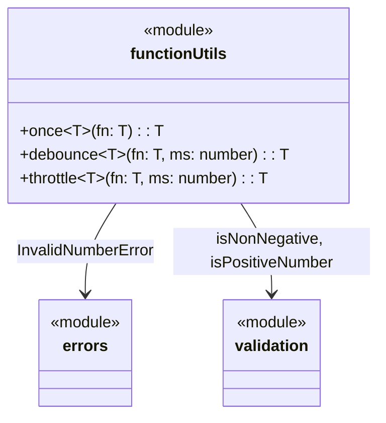

# C4 Code Level: Function Utilities

## Overview
- **Name**: Function Utilities
- **Description**: Higher-order function utilities for controlling function execution
- **Location**: `src/function`
- **Language**: TypeScript
- **Purpose**: Provides wrappers to control how and when functions execute — single execution (once), delayed execution (debounce), and rate-limited execution (throttle)
- **Parent Component**: TBD

## Code Elements

### Functions/Methods

#### `src/function/once.ts`
- `once<T extends (...args: any[]) => any>(fn: T): T` — Returns a wrapper that invokes `fn` only on the first call; subsequent calls return the cached result

#### `src/function/debounce.ts`
- `debounce<T extends (...args: any[]) => any>(fn: T, ms: number): T` — Returns a debounced version of `fn` that delays invocation until `ms` milliseconds after the last call. Throws `InvalidNumberError` if `ms` is negative

#### `src/function/throttle.ts`
- `throttle<T extends (...args: any[]) => any>(fn: T, ms: number): T` — Returns a throttled version of `fn` that invokes at most once per `ms` milliseconds. Throws `InvalidNumberError` if `ms` is not a positive number

#### `src/function/index.ts` (barrel export)
- Re-exports: `once`, `debounce`, `throttle`

## Dependencies

### Internal Dependencies
- `src/errors/index.js` — `InvalidNumberError` (used by `debounce`, `throttle`)
- `src/validation/index.js` — `isNonNegative` (used by `debounce`), `isPositiveNumber` (used by `throttle`)

### External Dependencies
- None

## Relationships

