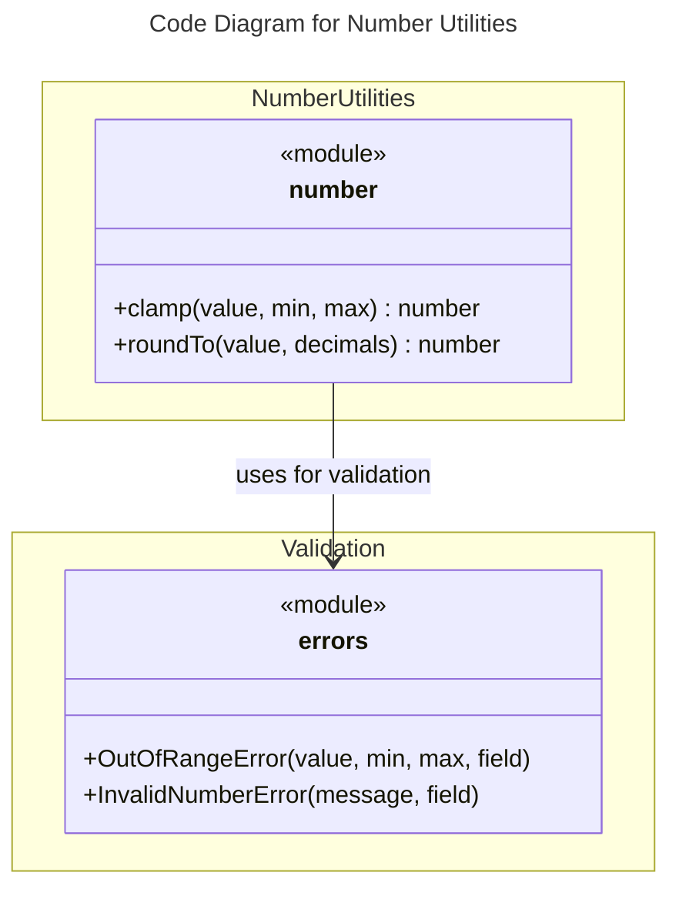

# C4 Code Level: Number Utilities

## Overview

- **Name**: Number Utilities Module
- **Description**: Pure functional utilities for numeric operations including range constraints and decimal rounding
- **Location**: `src/number`
- **Language**: TypeScript 5.x (ESM)
- **Purpose**: Provides type-safe, validated functions for common numeric operations with proper error handling
- **Parent Component**: [Number Utilities](./c4-component-number-utilities.md)

## Code Elements

### Functions/Methods

- `clamp(value: number, min: number, max: number): number`
  - Description: Constrains a number within a specified range [min, max]
  - Location: `src/number/clamp.ts:3-8`
  - Parameters:
    - `value: number` - The number to constrain
    - `min: number` - Lower bound (inclusive)
    - `max: number` - Upper bound (inclusive)
  - Return: `number` - The clamped value
  - Dependencies: `OutOfRangeError`
  - Throws: `OutOfRangeError` if min > max
  - Algorithm: Uses Math.min(Math.max(value, min), max) for efficient clamping

- `roundTo(value: number, decimals: number): number`
  - Description: Rounds a number to a specified number of decimal places
  - Location: `src/number/roundTo.ts:3-9`
  - Parameters:
    - `value: number` - The number to round
    - `decimals: number` - Number of decimal places (non-negative integer)
  - Return: `number` - The rounded number
  - Dependencies: `InvalidNumberError`
  - Throws: `InvalidNumberError` if decimals is negative or not an integer
  - Algorithm: Uses power-of-10 factor for precise rounding (handles floating-point precision)

## Dependencies

### Internal Dependencies

- `src/errors/index.ts` - `OutOfRangeError`, `InvalidNumberError` classes for validation errors

### External Dependencies

- TypeScript 5.x - Type system for type-safe function signatures
- ES2015+ - Native Math.min, Math.max, Math.pow, Math.round methods

## Relationships

## Test Coverage

- **Test Location**: `tests/number/`
- **Test Files**: 2 test files with 12 total test cases
  - `clamp.test.ts` - 6 test cases
  - `roundTo.test.ts` - 6 test cases
- **Verified by execution**: Yes (all tests passing)
- **Coverage Details**:
  - `clamp`: In-range values, boundary conditions, error handling
  - `roundTo`: Various decimal places, rounding rules, error handling

## Test Breakdown

### clamp (6 test cases)
1. Returns value when in range
2. Returns min when value too low
3. Returns max when value too high
4. Handles edge at min boundary
5. Handles edge at max boundary
6. Throws OutOfRangeError if min > max

### roundTo (6 test cases)
1. Rounds to 2 decimal places correctly
2. Rounds to integer (0 decimals)
3. Rounds up at midpoint (banker's rounding)
4. Handles already-rounded values
5. Throws InvalidNumberError for negative decimals
6. Throws InvalidNumberError for non-integer decimals

## Export

- **Barrel Export**: `src/number/index.ts` exports both functions as named exports
- **Re-exported from**: `src/index.ts` (main package entry point)
