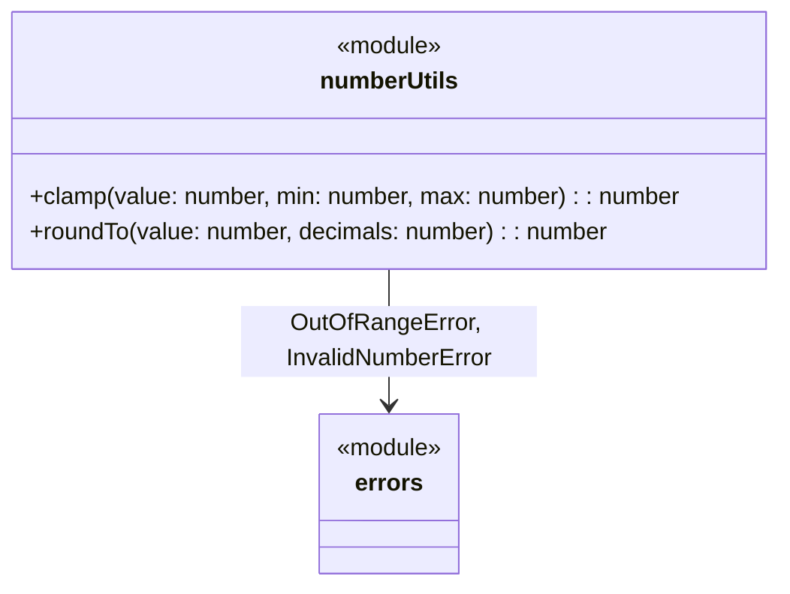

# C4 Code Level: Number Utilities

## Overview
- **Name**: Number Utilities
- **Description**: Numeric manipulation and rounding functions
- **Location**: `src/number`
- **Language**: TypeScript
- **Purpose**: Provides utilities for clamping numbers to a range and rounding to a specified number of decimal places
- **Parent Component**: [Primitive Utilities](c4-component-primitives.md)

## Code Elements

### Functions/Methods

#### `src/number/clamp.ts`
- `clamp(value: number, min: number, max: number): number` — Constrains a value to the inclusive range [min, max]. Throws `OutOfRangeError` if min > max

#### `src/number/roundTo.ts`
- `roundTo(value: number, decimals: number): number` — Rounds a number to the specified number of decimal places. Throws `InvalidNumberError` if decimals is not a non-negative integer

#### `src/number/index.ts` (barrel export)
- Re-exports: `clamp`, `roundTo`

## Dependencies

### Internal Dependencies
- `src/errors/index.js` — `OutOfRangeError` (used by `clamp`), `InvalidNumberError` (used by `roundTo`)

### External Dependencies
- None

## Relationships

