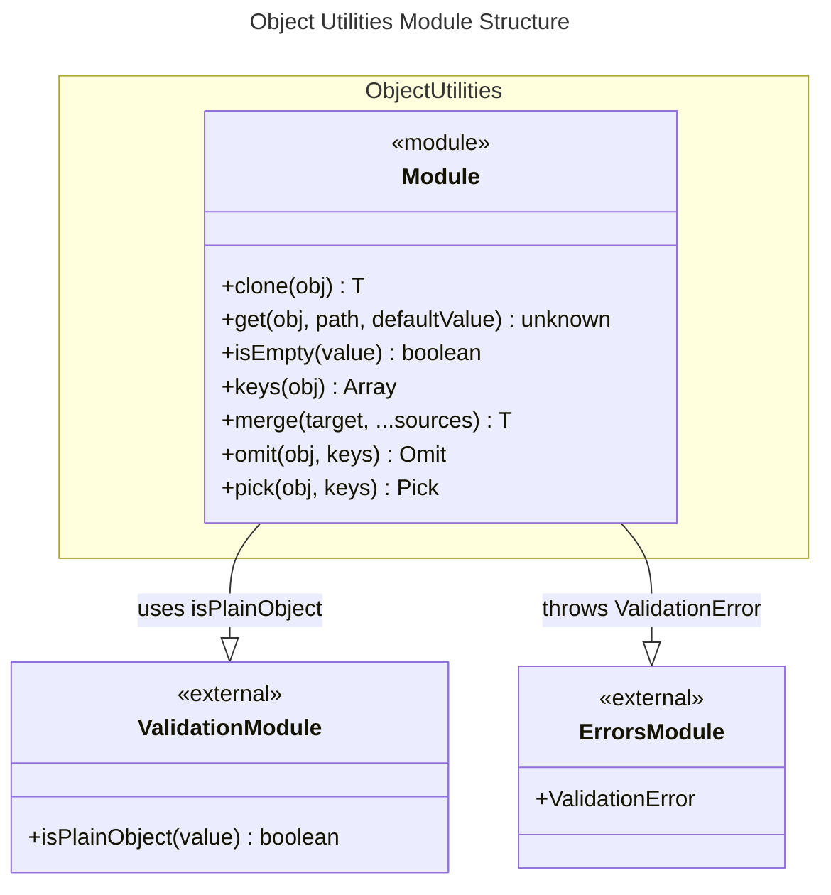

# C4 Code Level: Object Utilities

## Overview

- **Name**: Object Utilities Module
- **Description**: A collection of functions for safely manipulating, inspecting, and transforming JavaScript objects including deep cloning, property access, inspection, and merging.
- **Location**: src/object
- **Language**: TypeScript
- **Purpose**: Provides functional utilities for object manipulation with type safety and comprehensive error handling.
- **Parent Component**: TBD

## Code Elements

### Functions/Methods

- `clone<T>(obj: T): T`
  - Description: Creates a deep copy of any value using `structuredClone` with validation to reject functions and symbols
  - Location: src/object/clone.ts:14
  - Dependencies: ValidationError (src/errors/index.ts)

- `get(obj: unknown, path: string, defaultValue?: unknown): unknown`
  - Description: Safely retrieves nested property values using dot-notation path strings with fallback to default value
  - Location: src/object/get.ts:5
  - Dependencies: none

- `isEmpty(value: unknown): boolean`
  - Description: Checks if a value is empty (null, undefined, empty string, empty array, or empty plain object)
  - Location: src/object/isEmpty.ts:17
  - Dependencies: none

- `keys<T extends object>(obj: T): (keyof T)[]`
  - Description: Type-safe wrapper around Object.keys() that preserves the key type information
  - Location: src/object/keys.ts:1
  - Dependencies: none

- `merge<T extends Record<string, unknown>>(target: T, ...sources: Partial<T>[]): T`
  - Description: Deep merges multiple source objects recursively into a target object with index-based array merging
  - Location: src/object/merge.ts:19
  - Dependencies: isPlainObject (src/validation/index.ts)

- `omit<T extends Record<string, unknown>, K extends keyof T>(obj: T, keys: K[]): Omit<T, K>`
  - Description: Creates a new object excluding specified properties from the source object
  - Location: src/object/omit.ts:6
  - Dependencies: none

- `pick<T extends Record<string, unknown>, K extends keyof T>(obj: T, keys: K[]): Pick<T, K>`
  - Description: Creates a new object with only the specified properties from the source object
  - Location: src/object/pick.ts:6
  - Dependencies: none

## Dependencies

### Internal Dependencies

- `src/validation/index.ts` - isPlainObject function used in merge for recursive merging
- `src/errors/index.ts` - ValidationError and related error classes used in clone

### External Dependencies

- Built-in: `structuredClone` (ES2022 API)
- Built-in: `Object` global (Object.keys, Object.getPrototypeOf, Object.prototype)

## Relationships

## Notes

- All functions are designed to be pure (side-effect free) and type-safe
- The merge function performs recursive deep merging for plain objects and index-based overwriting for arrays
- The clone function will throw ValidationError if attempting to clone functions or symbols as these are not serializable
- The get function safely handles intermediate null/undefined values without throwing errors
- Type parameters are preserved throughout for maximum type inference in consuming code
