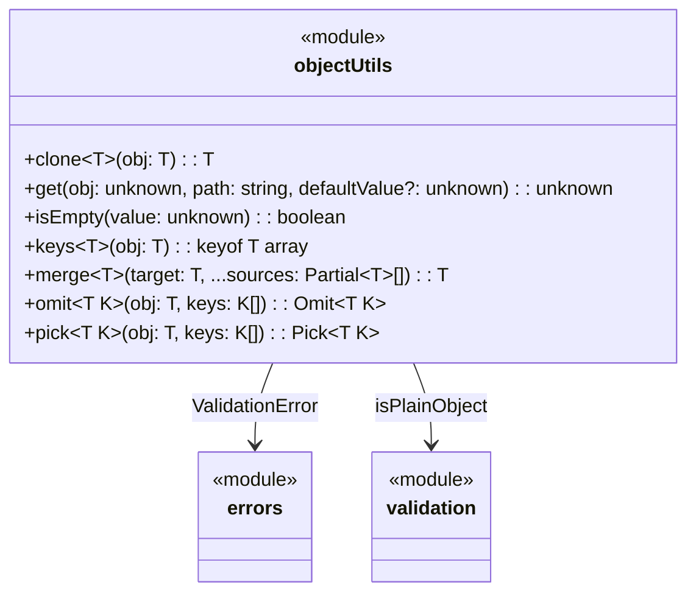

# C4 Code Level: Object Utilities

## Overview
- **Name**: Object Utilities
- **Description**: Collection of object manipulation and introspection functions
- **Location**: `src/object`
- **Language**: TypeScript
- **Purpose**: Provides utilities for cloning, merging, picking/omitting properties, safe nested access, emptiness checking, and typed key extraction
- **Parent Component**: [Collection Utilities](c4-component-collections.md)

## Code Elements

### Functions/Methods

#### `src/object/clone.ts`
- `clone<T>(obj: T): T` — Creates a deep copy using `structuredClone`. Throws `ValidationError` for functions and symbols

#### `src/object/get.ts`
- `get(obj: unknown, path: string, defaultValue?: unknown): unknown` — Safely retrieves a nested property using dot-notation path. Returns `defaultValue` (or undefined) if path doesn't exist

#### `src/object/isEmpty.ts`
- `isEmpty(value: unknown): boolean` — Returns true if value is null, undefined, empty string, empty array, or empty plain object. Returns false for 0, false, NaN, Date, RegExp, Map, Set

#### `src/object/keys.ts`
- `keys<T extends object>(obj: T): (keyof T)[]` — Type-safe wrapper around `Object.keys` returning typed key array

#### `src/object/merge.ts`
- `merge<T extends Record<string, unknown>>(target: T, ...sources: Partial<T>[]): T` — Deep merges source objects into target. Plain objects merge recursively, arrays use index-based strategy, primitives overwrite. Null/undefined sources are skipped

#### `src/object/omit.ts`
- `omit<T extends Record<string, unknown>, K extends keyof T>(obj: T, keys: K[]): Omit<T, K>` — Creates a new object excluding the specified properties

#### `src/object/pick.ts`
- `pick<T extends Record<string, unknown>, K extends keyof T>(obj: T, keys: K[]): Pick<T, K>` — Creates a new object with only the specified properties

#### `src/object/index.ts` (barrel export)
- Re-exports: `clone`, `get`, `isEmpty`, `keys`, `merge`, `omit`, `pick`

## Dependencies

### Internal Dependencies
- `src/errors/index.js` — `ValidationError` (used by `clone`)
- `src/validation/index.js` — `isPlainObject` (used by `merge`)

### External Dependencies
- None

## Relationships

