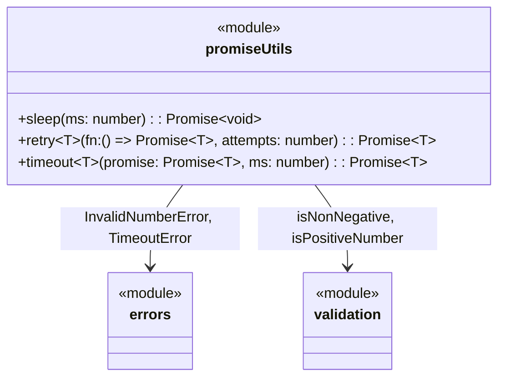

# C4 Code Level: Promise Utilities

## Overview
- **Name**: Promise Utilities
- **Description**: Async helper functions for common promise patterns
- **Location**: `src/promise`
- **Language**: TypeScript
- **Purpose**: Provides utilities for delaying execution (sleep), retrying failed async operations, and adding timeouts to promises
- **Parent Component**: [Async & Control Flow](c4-component-async.md)

## Code Elements

### Functions/Methods

#### `src/promise/sleep.ts`
- `sleep(ms: number): Promise<void>` — Returns a promise that resolves after `ms` milliseconds. Rejects with `InvalidNumberError` if `ms` is negative

#### `src/promise/retry.ts`
- `retry<T>(fn: () => Promise<T>, attempts: number): Promise<T>` — Retries the async function up to `attempts` times. Throws the last error if all attempts fail. Throws `InvalidNumberError` if attempts is not a positive integer

#### `src/promise/timeout.ts`
- `timeout<T>(promise: Promise<T>, ms: number): Promise<T>` — Races a promise against a timer. Rejects with `TimeoutError` if the timer fires first. Throws `InvalidNumberError` if `ms` is not a positive number

#### `src/promise/index.ts` (barrel export)
- Re-exports: `sleep`, `retry`, `timeout`

## Dependencies

### Internal Dependencies
- `src/errors/index.js` — `InvalidNumberError` (used by `sleep`, `retry`, `timeout`), `TimeoutError` (used by `timeout`)
- `src/validation/index.js` — `isNonNegative` (used by `sleep`), `isPositiveNumber` (used by `retry`, `timeout`)

### External Dependencies
- None

## Relationships

