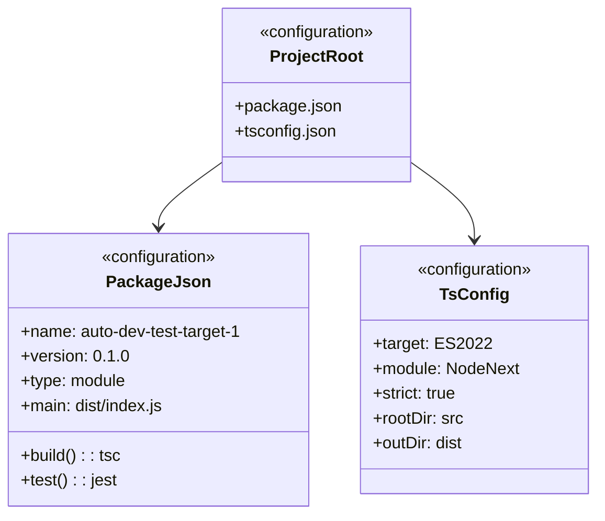

# C4 Code Level: Project Root

## Overview
- **Name**: Project Root
- **Description**: Package configuration and TypeScript build setup for the utility library
- **Location**: `.`
- **Language**: JSON, TypeScript config
- **Purpose**: Defines project metadata, dependencies, build scripts, and TypeScript compiler options
- **Parent Component**: TBD

## Code Elements

### Configuration Files

- `package.json`
  - Description: NPM package manifest defining project metadata, scripts, and dependencies
  - Location: package.json
  - Key fields:
    - `name`: "auto-dev-test-target-1"
    - `version`: "0.1.0"
    - `type`: "module" (ESM)
    - `main`: "dist/index.js"
    - `types`: "dist/index.d.ts"
  - Scripts: `build` (tsc), `test` (jest), `lint` (placeholder)

- `tsconfig.json`
  - Description: TypeScript compiler configuration targeting ES2022 with NodeNext module resolution
  - Location: tsconfig.json
  - Key options:
    - `target`: ES2022
    - `module`: NodeNext
    - `moduleResolution`: NodeNext
    - `strict`: true
    - `declaration`: true
    - `rootDir`: ./src
    - `outDir`: ./dist

## Dependencies

### Internal Dependencies
- None (root configuration)

### External Dependencies
- **typescript** ^5.3.0 — TypeScript compiler
- **jest** ^30.2.0 — Test runner
- **ts-jest** ^29.4.6 — TypeScript Jest transformer
- **@types/jest** ^30.0.0 — Jest type definitions
- **@types/node** ^20.10.0 — Node.js type definitions

## Relationships

