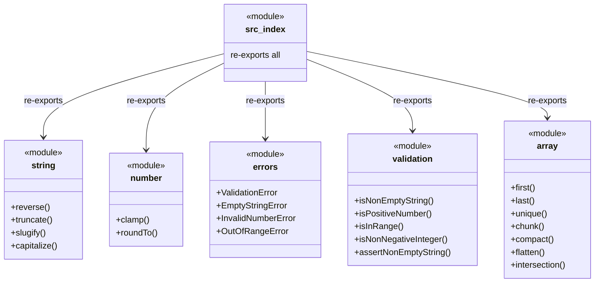

# C4 Code Level: Library Root Entry Point

## Overview
- **Name**: Library Root Entry Point
- **Description**: Barrel export file that re-exports the entire public API of the utility library from a single entry point.
- **Location**: src
- **Language**: TypeScript
- **Purpose**: Serves as the main package entry point, aggregating and re-exporting all modules (string, number, errors, validation, array) so consumers can import from a single path.

## Code Elements

### Modules

- `src/index.ts` (barrel export)
  - Description: Re-exports all public APIs from every sub-module. This is the library's primary entry point.
  - Location: src/index.ts
  - Exports (via re-export):
    - All from `src/string/index.ts` — `reverse`, `truncate`, `slugify`, `capitalize`
    - All from `src/number/index.ts` — `clamp`, `roundTo`
    - All from `src/errors/index.ts` — `ValidationError`, `EmptyStringError`, `InvalidNumberError`, `OutOfRangeError`
    - All from `src/validation/index.ts` — `isNonEmptyString`, `isPositiveNumber`, `isInRange`, `isNonNegativeInteger`, `assertNonEmptyString`
    - All from `src/array/index.ts` — `first`, `last`, `unique`, `chunk`, `compact`, `flatten`, `intersection`

## Dependencies

### Internal Dependencies
- `src/string/index.ts`
- `src/number/index.ts`
- `src/errors/index.ts`
- `src/validation/index.ts`
- `src/array/index.ts`

### External Dependencies
- None

## Relationships

