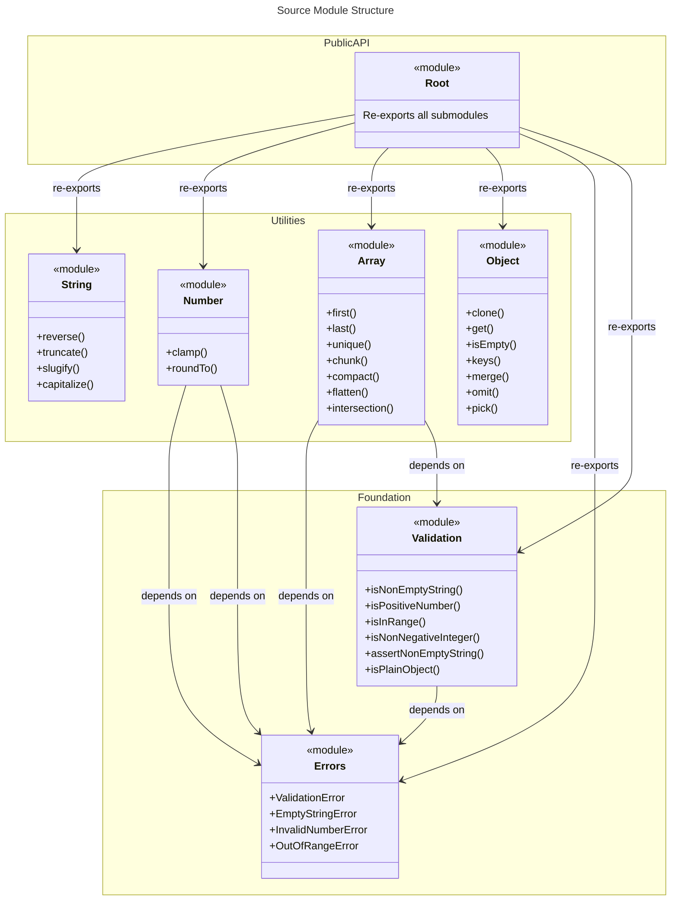

# C4 Code Level: Source Root Module (src)

## Overview

- **Name**: Utility Library Root Module
- **Description**: Main barrel file aggregating and re-exporting all utility functions and error classes from submodules
- **Location**: `src/`
- **Language**: TypeScript 5.x (ESM)
- **Purpose**: Provides the public API surface for the entire utility library, enabling simple single-import statements
- **Parent Component**: TBD

## Code Elements

### Module Structure

The `src/` directory contains 6 functional submodules:

| Module | Export Count | Purpose |
|--------|------------|---------|
| `string/` | 4 | String manipulation utilities |
| `number/` | 2 | Numeric operation utilities |
| `errors/` | 4 | Custom error class hierarchy |
| `validation/` | 6 | Type guard and validation functions |
| `array/` | 7 | Array transformation and set operations |
| `object/` | 7 | Object property manipulation and merging |

### Root Entry Point (src/index.ts)

- **Location**: `src/index.ts`
- **Type**: Barrel/aggregation file
- **Content**: 6 wildcard re-exports covering all submodules
- **Purpose**: Provides unified public API surface

```typescript
export * from './string/index.js';
export * from './number/index.js';
export * from './errors/index.js';
export * from './validation/index.js';
export * from './array/index.js';
export * from './object/index.js';
```

## Public API Surface

Total exported items: 30 (functions and classes)

### By Category

#### String Utilities (4 functions)
- `reverse(str: string): string` - Reverses a string
- `truncate(str: string, length: number): string` - Truncates string to length
- `slugify(str: string): string` - Converts string to URL-friendly slug
- `capitalize(str: string): string` - Capitalizes first character, lowercases rest

#### Number Utilities (2 functions)
- `clamp(value: number, min: number, max: number): number` - Constrains value to range
- `roundTo(value: number, decimals: number): number` - Rounds to decimal places

#### Error Classes (4 classes)
- `ValidationError` - Base validation error with optional field
- `EmptyStringError` - Error for empty strings
- `InvalidNumberError` - Error for invalid numbers
- `OutOfRangeError` - Error for out-of-range values

#### Validation Functions (6 functions)
- `isNonEmptyString(value: unknown): boolean` - Type guard for non-empty strings
- `isPositiveNumber(value: unknown): boolean` - Type guard for positive numbers
- `isInRange(value: number, min: number, max: number): boolean` - Range check
- `isNonNegativeInteger(value: unknown): boolean` - Type guard for non-negative integers
- `assertNonEmptyString(value: unknown, field?: string): asserts value is string` - String assertion
- `isPlainObject(value: unknown): boolean` - Type guard for plain objects

#### Array Utilities (7 functions)
- `first<T>(arr: T[]): T | undefined` - Get first element
- `last<T>(arr: T[]): T | undefined` - Get last element
- `unique<T>(arr: T[]): T[]` - Remove duplicates
- `chunk<T>(arr: T[], size: number): T[][]` - Split into chunks
- `compact<T>(arr: T[]): T[]` - Remove falsy values
- `flatten(arr: any[], depth?: number): any[]` - Recursively flatten
- `intersection<T>(...arrays: T[][]): T[]` - Set intersection

#### Object Utilities (7 functions)
- `clone(obj: any): any` - Deep clone objects
- `get(obj: Record<string, any>, path: string): any` - Get nested property
- `isEmpty(obj: Record<string, any>): boolean` - Check if object is empty
- `keys(obj: Record<string, any>): string[]` - Get object keys
- `merge(...sources: any[]): any` - Deep merge objects
- `omit(obj: Record<string, any>, keys: string[]): Record<string, any>` - Exclude properties
- `pick(obj: Record<string, any>, keys: string[]): Record<string, any>` - Include properties

## Dependencies

### Internal Dependencies (all submodules)

- `src/string/` - 4 string utility functions
- `src/number/` - 2 number utility functions
- `src/errors/` - 4 error classes
- `src/validation/` - 6 type guards and assertions
- `src/array/` - 7 array utility functions
- `src/object/` - 7 object utility functions

### External Dependencies

- TypeScript 5.x - Type system for exports
- ES2015+ - Module syntax (import/export)

## Module Graph


```mermaid
---
title: Source Module Structure
---
classDiagram
    namespace PublicAPI {
        class Root {
            <<module>>
            Re-exports all submodules
        }
    }

    namespace Utilities {
        class String {
            <<module>>
            +reverse()
            +truncate()
            +slugify()
            +capitalize()
        }
        class Number {
            <<module>>
            +clamp()
            +roundTo()
        }
        class Array {
            <<module>>
            +first()
            +last()
            +unique()
            +chunk()
            +compact()
            +flatten()
            +intersection()
        }
        class Object {
            <<module>>
            +clone()
            +get()
            +isEmpty()
            +keys()
            +merge()
            +omit()
            +pick()
        }
    }

    namespace Foundation {
        class Errors {
            <<module>>
            +ValidationError
            +EmptyStringError
            +InvalidNumberError
            +OutOfRangeError
        }
        class Validation {
            <<module>>
            +isNonEmptyString()
            +isPositiveNumber()
            +isInRange()
            +isNonNegativeInteger()
            +assertNonEmptyString()
            +isPlainObject()
        }
    }

    Root --> String : re-exports
    Root --> Number : re-exports
    Root --> Array : re-exports
    Root --> Object : re-exports
    Root --> Errors : re-exports
    Root --> Validation : re-exports

    Number --> Errors : depends on
    Array --> Errors : depends on
    Array --> Validation : depends on
    Number --> Errors : depends on
    Validation --> Errors : depends on
```

## Module Dependencies Between Submodules

- **Array module** depends on:
  - `src/errors/` for InvalidNumberError
  - `src/validation/` for type guards

- **Number module** depends on:
  - `src/errors/` for OutOfRangeError and InvalidNumberError

- **Validation module** depends on:
  - `src/errors/` for EmptyStringError

- **String, Object, Errors** modules have no internal dependencies

## Test Coverage

- **Total test files in project**: 23 test files
- **Assigned batch processing**: Tests organized by source module
  - Array tests: `tests/array/` (7 files, 53 cases)
  - Number tests: `tests/number/` (2 files, 12 cases)
  - Error tests: `tests/errors/` (1 file, 28 cases)
  - Other modules (string, object, validation): Separate test files

- **Overall project test count**: 224 tests (all passing)

## Export Pattern

### Barrel Export Design

The library uses a barrel/aggregation pattern:
- Each submodule (`array/`, `number/`, etc.) has an `index.ts` that exports its functions
- The root `src/index.ts` re-exports all submodule exports
- This enables both:
  - Deep imports: `import { chunk } from 'src/array'`
  - Shallow imports: `import { chunk } from 'src'`

### Build Output

After TypeScript compilation:
- Source `.ts` files compiled to `.js` (ES modules)
- Declaration files (`.d.ts`) generated for full type support
- Output located in `dist/` directory

## Size and Scope

- **File count**: 30 source files (24 implementation + 6 index files)
- **Line count**: ~400-500 lines total (excluding tests)
- **Language paradigm**: Functional programming with TypeScript typing
- **Module style**: ES6 modules with named exports

## Usage Example

```typescript
// Import from root (shallow import)
import { chunk, clamp, clone, ValidationError } from 'src';

// Or import from specific module (deep import)
import { chunk } from 'src/array';
import { clamp } from 'src/number';
```

## Notes

- This is a utility library designed for reusability
- All functions are pure (no side effects)
- Full TypeScript support with type preservation through generics
- Comprehensive error handling with custom error classes
- Validation functions provide runtime type safety
