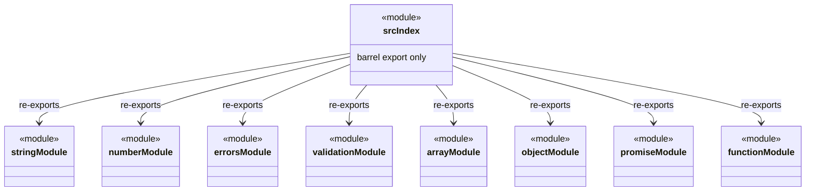

# C4 Code Level: Source Entry Point

## Overview
- **Name**: Source Entry Point
- **Description**: Main barrel export re-exporting all utility modules from the library
- **Location**: `src`
- **Language**: TypeScript
- **Purpose**: Provides a single entry point that re-exports all sub-module utilities for consumers
- **Parent Component**: TBD

## Code Elements

### Functions/Methods

- `src/index.ts` (barrel export — no functions defined directly)
  - Re-exports from: `string`, `number`, `errors`, `validation`, `array`, `object`, `promise`, `function`

## Dependencies

### Internal Dependencies
- `src/string/index.js` — String utility functions
- `src/number/index.js` — Number utility functions
- `src/errors/index.js` — Custom error classes
- `src/validation/index.js` — Validation helper functions
- `src/array/index.js` — Array utility functions
- `src/object/index.js` — Object utility functions
- `src/promise/index.js` — Promise utility functions
- `src/function/index.js` — Function utility functions

### External Dependencies
- None

## Relationships

```mermaid
classDiagram
    class srcIndex {
        <<module>>
        barrel export only
    }
    class stringModule {
        <<module>>
    }
    class numberModule {
        <<module>>
    }
    class errorsModule {
        <<module>>
    }
    class validationModule {
        <<module>>
    }
    class arrayModule {
        <<module>>
    }
    class objectModule {
        <<module>>
    }
    class promiseModule {
        <<module>>
    }
    class functionModule {
        <<module>>
    }
    srcIndex --> stringModule : re-exports
    srcIndex --> numberModule : re-exports
    srcIndex --> errorsModule : re-exports
    srcIndex --> validationModule : re-exports
    srcIndex --> arrayModule : re-exports
    srcIndex --> objectModule : re-exports
    srcIndex --> promiseModule : re-exports
    srcIndex --> functionModule : re-exports
```
