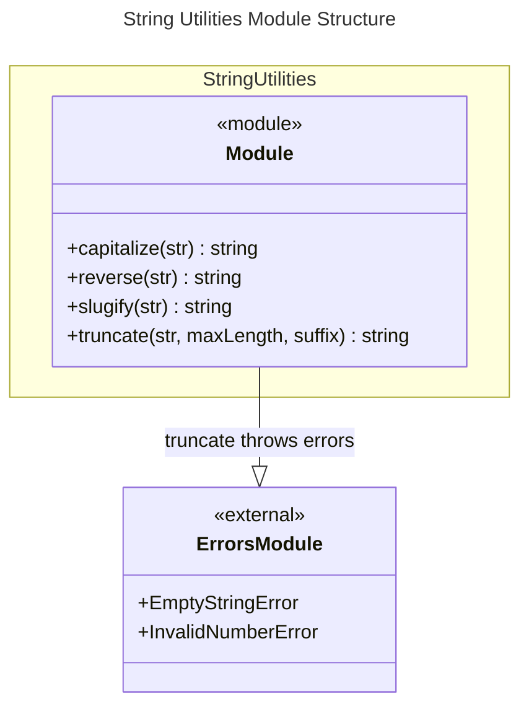

# C4 Code Level: String Utilities

## Overview

- **Name**: String Utilities Module
- **Description**: A collection of functions for string manipulation and transformation including capitalization, reversal, URL slug generation, and truncation with suffix handling.
- **Location**: src/string
- **Language**: TypeScript
- **Purpose**: Provides functional utilities for common string transformations with error handling and type safety.
- **Parent Component**: [String Utilities](./c4-component-string-utilities.md)

## Code Elements

### Functions/Methods

- `capitalize(str: string): string`
  - Description: Capitalizes the first character of a string and lowercases the rest
  - Location: src/string/capitalize.ts:1
  - Dependencies: none

- `reverse(str: string): string`
  - Description: Reverses a string character by character, correctly handling Unicode characters via array spread operator
  - Location: src/string/reverse.ts:1
  - Dependencies: none

- `slugify(str: string): string`
  - Description: Converts a string to a URL-safe slug by lowercasing, replacing spaces with hyphens, removing special characters, and normalizing consecutive hyphens
  - Location: src/string/slugify.ts:1
  - Dependencies: none

- `truncate(str: string, maxLength: number, suffix?: string = '...'): string`
  - Description: Truncates a string to maxLength characters and appends a suffix, with validation for valid parameters
  - Location: src/string/truncate.ts:3
  - Dependencies: EmptyStringError, InvalidNumberError (src/errors/index.ts)

## Dependencies

### Internal Dependencies

- `src/errors/index.ts` - EmptyStringError and InvalidNumberError used in truncate for parameter validation

### External Dependencies

- Built-in: `String` methods (charAt, slice, toLowerCase, etc.)
- Built-in: Regular expressions for pattern matching and replacement

## Relationships

## Notes

- capitalize, reverse, and slugify are pure functions with no error handling
- truncate function includes parameter validation and throws descriptive errors for invalid inputs
- reverse uses array spread operator to correctly handle Unicode characters that may require multiple code units
- slugify handles multiple consecutive spaces and leading/trailing hyphens by normalizing them
- All functions preserve string immutability (no modifications to input strings)
