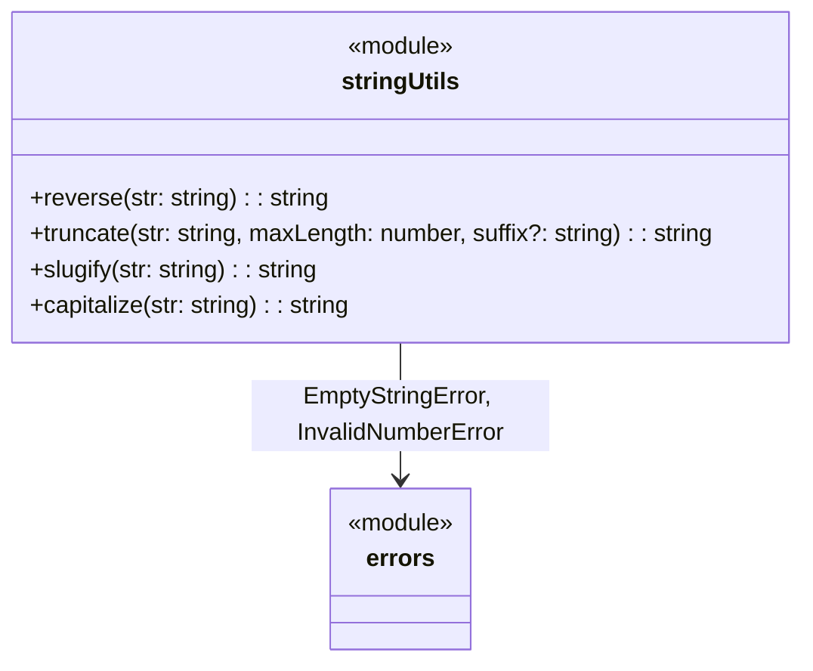

# C4 Code Level: String Utilities

## Overview
- **Name**: String Utilities
- **Description**: Collection of string transformation functions
- **Location**: `src/string`
- **Language**: TypeScript
- **Purpose**: Provides common string operations including reversing, truncating with suffix, URL-safe slug generation, and capitalization
- **Parent Component**: TBD

## Code Elements

### Functions/Methods

#### `src/string/reverse.ts`
- `reverse(str: string): string` — Reverses a string using spread operator and Array.reverse() (handles Unicode correctly via iterator)

#### `src/string/truncate.ts`
- `truncate(str: string, maxLength: number, suffix?: string): string` — Truncates a string to `maxLength` characters, appending `suffix` (default `'...'`). Throws `EmptyStringError` if suffix is empty, `InvalidNumberError` if maxLength is invalid

#### `src/string/slugify.ts`
- `slugify(str: string): string` — Converts a string to a URL-safe slug: lowercases, replaces whitespace with hyphens, removes non-alphanumeric characters, and trims leading/trailing hyphens

#### `src/string/capitalize.ts`
- `capitalize(str: string): string` — Capitalizes the first character and lowercases the rest. Returns empty string unchanged

#### `src/string/index.ts` (barrel export)
- Re-exports: `reverse`, `truncate`, `slugify`, `capitalize`

## Dependencies

### Internal Dependencies
- `src/errors/index.js` — `EmptyStringError`, `InvalidNumberError` (used by `truncate`)

### External Dependencies
- None

## Relationships

