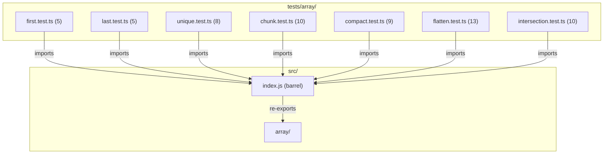

# C4 Code Level: Array Utility Tests

## Overview
- **Name**: Array Utility Tests
- **Description**: Test suite for all array manipulation utility functions
- **Location**: tests/array/
- **Language**: TypeScript (Jest)
- **Purpose**: Validates correctness, edge cases, type safety, and error handling for array utilities
- **Parent Component**: TBD

## Test Inventory

| File | Tests | Description |
|------|-------|-------------|
| first.test.ts | 5 | Tests for `first()` — returns first element |
| last.test.ts | 5 | Tests for `last()` — returns last element |
| unique.test.ts | 8 | Tests for `unique()` — deduplicates arrays |
| chunk.test.ts | 10 | Tests for `chunk()` — splits into fixed-size chunks |
| compact.test.ts | 9 | Tests for `compact()` — removes falsy values |
| flatten.test.ts | 13 | Tests for `flatten()` — flattens nested arrays |
| intersection.test.ts | 10 | Tests for `intersection()` — finds common elements |
| **Total** | **60** | |

**Test count: 60 (verified by `npm test`)**

## Code Elements

### Test Suites

- `describe('first', ...)`
  - Location: tests/array/first.test.ts:3
  - Tests: 5 (non-empty array, empty array, single-element, generic type, type narrowing)
  - Dependencies: `first` from `../../src/index.js`

- `describe('last', ...)`
  - Location: tests/array/last.test.ts:3
  - Tests: 5 (non-empty array, empty array, single-element, generic type, type narrowing)
  - Dependencies: `last` from `../../src/index.js`

- `describe('unique', ...)`
  - Location: tests/array/unique.test.ts:3
  - Tests: 8 (duplicates, empty input, no duplicates, all duplicates, NaN handling, order preservation, generic type, special numerics)
  - Dependencies: `unique` from `../../src/index.js`

- `describe('chunk', ...)`
  - Location: tests/array/chunk.test.ts:3
  - Tests: 10 (basic splitting, empty input, size equals length, size > length, remainders, size=1, error for <=0, error for non-integer, error for NaN/Infinity, generic type)
  - Dependencies: `chunk`, `InvalidNumberError` from `../../src/index.js`

- `describe('compact', ...)`
  - Location: tests/array/compact.test.ts:3
  - Tests: 9 (mixed falsy removal, all six falsy types, truthy preservation, string "0", empty input, no falsy values, all falsy, generic type, special numerics)
  - Dependencies: `compact` from `../../src/index.js`

- `describe('flatten', ...)`
  - Location: tests/array/flatten.test.ts:4
  - Tests: 13 (depth 1 default, depth 0, depth 1/2/3+, Infinity, empty input, no nested, mixed, negative depth error, non-integer error, NaN error, null/undefined preservation)
  - Dependencies: `flatten`, `InvalidNumberError` from `../../src/index.js`

- `describe('intersection', ...)`
  - Location: tests/array/intersection.test.ts:3
  - Tests: 10 (two arrays, three+ arrays, no common, no args, empty array, single array, deduplication, strict equality, order preservation, generic type)
  - Dependencies: `intersection` from `../../src/index.js`

## Dependencies

### Internal Dependencies
- `../../src/index.js` — barrel export providing `first`, `last`, `unique`, `chunk`, `compact`, `flatten`, `intersection`
- `../../src/errors/index.js` — `InvalidNumberError` (via re-export)

### External Dependencies
- `jest` / `@jest/globals` — test framework

## Coverage Summary

Tests cover all 7 array utility functions with emphasis on: basic functionality, empty/edge inputs, type preservation, error validation (InvalidNumberError for invalid numeric parameters), and special numeric values (NaN, Infinity, -0).

## Relationships

