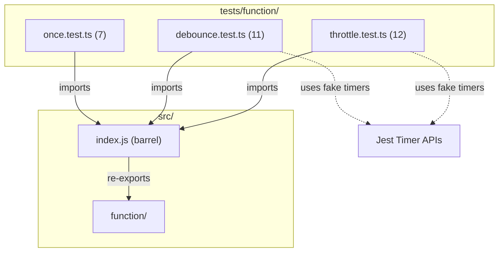

# C4 Code Level: Function Utility Tests

## Overview
- **Name**: Function Utility Tests
- **Description**: Test suite for function-wrapping utilities (once, debounce, throttle)
- **Location**: tests/function/
- **Language**: TypeScript (Jest)
- **Purpose**: Validates execution control, timing behavior, argument passing, this-context preservation, and input validation
- **Parent Component**: [Async & Control Flow](c4-component-async.md)

## Test Inventory

| File | Tests | Description |
|------|-------|-------------|
| once.test.ts | 7 | Tests for `once()` — single-execution wrapper |
| debounce.test.ts | 11 | Tests for `debounce()` — delayed coalescing wrapper |
| throttle.test.ts | 12 | Tests for `throttle()` — rate-limiting wrapper |
| **Total** | **30** | |

**Test count: 30 (verified by `npm test`)**

## Code Elements

### Test Suites

- `describe('once', ...)`
  - Location: tests/function/once.test.ts:3
  - Tests: 7 (single execution, cached result, first-call args, ignores subsequent args, various return types, this context, type signature)
  - Dependencies: `once` from `../../src/index.js`

- `describe('debounce', ...)`
  - Location: tests/function/debounce.test.ts:3
  - Tests: 11
  - Setup: `jest.useFakeTimers()` / `jest.useRealTimers()`
  - Test categories:
    - Timing: executes after delay, coalesces rapid calls, resets timer, defers with ms=0
    - Arguments: uses last call arguments
    - Validation: throws `InvalidNumberError` for negative, NaN, Infinity, non-numeric
    - Context: preserves `this` context, preserves function signature type
  - Dependencies: `debounce`, `InvalidNumberError` from `../../src/index.js`

- `describe('throttle', ...)`
  - Location: tests/function/throttle.test.ts:3
  - Tests: 12
  - Setup: `jest.useFakeTimers()` / `jest.useRealTimers()`
  - Test categories:
    - Timing: executes first call immediately, ignores calls within window, executes after window elapses, works across multiple windows
    - Arguments: passes arguments to original function
    - Validation: throws `InvalidNumberError` for ms=0, NaN, Infinity, negative, non-numeric
    - Context: preserves `this` context, preserves function signature type
  - Dependencies: `throttle`, `InvalidNumberError` from `../../src/index.js`

## Dependencies

### Internal Dependencies
- `../../src/index.js` — barrel export providing `once`, `debounce`, `throttle`
- `../../src/errors/index.js` — `InvalidNumberError` (via re-export)

### External Dependencies
- `jest` — test framework with fake timer APIs (`useFakeTimers`, `advanceTimersByTimeAsync`)

## Coverage Summary

Tests cover all 3 function utilities with emphasis on: execution semantics (once-only, delayed, rate-limited), argument forwarding, `this` context binding, TypeScript type preservation, and input validation via `InvalidNumberError`.

## Relationships

