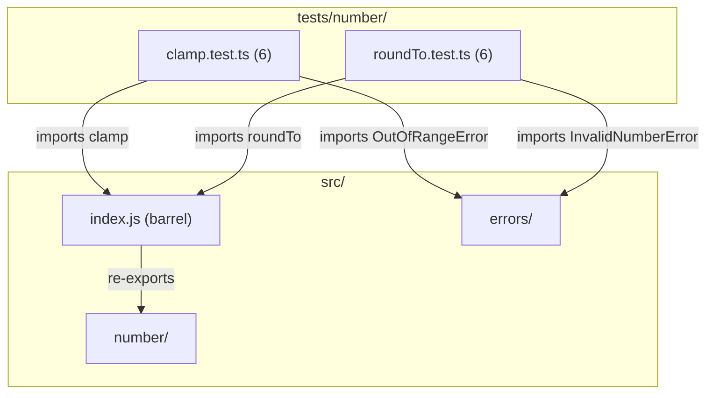

# C4 Code Level: Number Utility Tests

## Overview
- **Name**: Number Utility Tests
- **Description**: Test suite for numeric utility functions (clamp, roundTo)
- **Location**: tests/number/
- **Language**: TypeScript (Jest)
- **Purpose**: Validates value clamping and decimal rounding with edge cases and error handling
- **Parent Component**: TBD

## Test Inventory

| File | Tests | Description |
|------|-------|-------------|
| clamp.test.ts | 6 | Tests for `clamp()` — constrains value to [min, max] range |
| roundTo.test.ts | 6 | Tests for `roundTo()` — rounds to N decimal places |
| **Total** | **12** | |

**Test count: 12 (verified by `npm test`)**

## Code Elements

### Test Suites

- `describe('clamp', ...)`
  - Location: tests/number/clamp.test.ts:4
  - Tests: 6 (in range, below min, above max, edge at min, edge at max, throws OutOfRangeError if min > max)
  - Dependencies: `clamp` from `../../src/index.js`, `OutOfRangeError` from `../../src/errors/index.js`

- `describe('roundTo', ...)`
  - Location: tests/number/roundTo.test.ts:4
  - Tests: 6 (2 decimal places, to integer, midpoint rounding, already-rounded, throws InvalidNumberError for negative decimals, throws for non-integer decimals)
  - Dependencies: `roundTo` from `../../src/index.js`, `InvalidNumberError` from `../../src/errors/index.js`

## Dependencies

### Internal Dependencies
- `../../src/index.js` — barrel export providing `clamp`, `roundTo`
- `../../src/errors/index.js` — `OutOfRangeError`, `InvalidNumberError`

### External Dependencies
- `jest` — test framework (implicit globals)

## Coverage Summary

Tests cover both number utilities: `clamp` validates range boundary behavior and error on invalid ranges; `roundTo` validates rounding precision and error on invalid decimal parameters.

## Relationships

