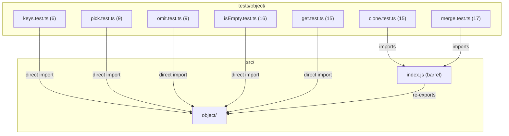

# C4 Code Level: Object Utility Tests

## Overview
- **Name**: Object Utility Tests
- **Description**: Test suite for object manipulation utility functions
- **Location**: tests/object/
- **Language**: TypeScript (Jest)
- **Purpose**: Validates object introspection, transformation, deep operations, and type safety for all object utilities
- **Parent Component**: TBD

## Test Inventory

| File | Tests | Description |
|------|-------|-------------|
| keys.test.ts | 6 | Tests for `keys()` — typed Object.keys |
| pick.test.ts | 9 | Tests for `pick()` — select properties by key |
| omit.test.ts | 9 | Tests for `omit()` — exclude properties by key |
| isEmpty.test.ts | 16 | Tests for `isEmpty()` — checks if value is empty |
| get.test.ts | 15 | Tests for `get()` — dot-path property access |
| clone.test.ts | 15 | Tests for `clone()` — deep clone with circular ref support |
| merge.test.ts | 17 | Tests for `merge()` — deep merge multiple objects |
| **Total** | **87** | |

**Test count: 87 (verified by `npm test`)**

## Code Elements

### Test Suites

- `describe('keys', ...)`
  - Location: tests/object/keys.test.ts:3
  - Tests: 6 (populated object, empty object, typed result, no inherited props, various value types, single-property)
  - Dependencies: `keys` from `../../src/object/keys`

- `describe('pick', ...)`
  - Location: tests/object/pick.test.ts:3
  - Tests: 9 (single prop, multiple props, empty keys, type preservation, immutability, various value types, all keys, type assertion, end-to-end import)
  - Dependencies: `pick` from `../../src/object/pick`, `../../src/index`

- `describe('omit', ...)`
  - Location: tests/object/omit.test.ts:3
  - Tests: 9 (single prop, multiple props, empty keys, all keys, type preservation, immutability, various value types, type assertion, end-to-end import)
  - Dependencies: `omit` from `../../src/object/omit`, `../../src/index`

- `describe('isEmpty', ...)`
  - Location: tests/object/isEmpty.test.ts:3
  - Tests: 16 (null, undefined, empty string, empty array, empty object, 0, false, NaN, non-empty string, non-empty array, object with props, non-zero number, true, Date, nested empty, root import)
  - Dependencies: `isEmpty` from `../../src/object/isEmpty`, `../../src/index`

- `describe('get', ...)`
  - Location: tests/object/get.test.ts:3
  - Tests: 15 (top-level, deep nested, array index, nested through array, missing top-level, missing nested, null intermediate, undefined intermediate, default value, actual vs default, empty path, consecutive dots, trailing dot, various leaf types, root import)
  - Dependencies: `get` from `../../src/object/get`, `../../src/index`

- `describe('clone', ...)`
  - Location: tests/object/clone.test.ts:4
  - Tests: 15 (simple object, nested objects, arrays in objects, Date objects, RegExp objects, circular references, throws for functions, throws for symbols, null values, undefined values, empty object, arrays directly, primitives, string/number/boolean, end-to-end)
  - Dependencies: `clone`, `ValidationError` from `../../src/index.js`

- `describe('merge', ...)`
  - Location: tests/object/merge.test.ts:6
  - Tests: 17 (flat merge, override, deep nested, array index merge, 3+ sources, null source, undefined source, target immutability, source immutability, nested in array, new keys, subset keys, empty source, 3+ level deep, mixed types object→primitive, primitive→object, end-to-end)
  - Dependencies: `merge` from `../../src/index.js`

## Dependencies

### Internal Dependencies
- `../../src/object/keys` — direct module import
- `../../src/object/pick` — direct module import
- `../../src/object/omit` — direct module import
- `../../src/object/isEmpty` — direct module import
- `../../src/object/get` — direct module import
- `../../src/index.js` — barrel export (clone, merge, ValidationError, and end-to-end tests)

### External Dependencies
- `jest` / `@jest/globals` — test framework

## Coverage Summary

Tests cover all 7 object utilities comprehensively. Key validation areas include: type-safe return types (keys, pick, omit), immutability guarantees (pick, omit, merge), deep operations (clone with circular refs, merge with 3+ levels), nullish handling (isEmpty, get), and error validation (clone throws for functions/symbols).

## Relationships

