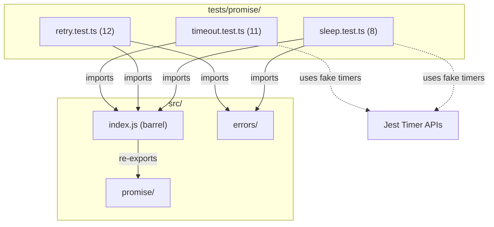

# C4 Code Level: Promise Utility Tests

## Overview
- **Name**: Promise Utility Tests
- **Description**: Test suite for async/promise utility functions (sleep, retry, timeout)
- **Location**: tests/promise/
- **Language**: TypeScript (Jest)
- **Purpose**: Validates async timing, retry logic, timeout behavior, and input validation for promise utilities
- **Parent Component**: [Async & Control Flow](c4-component-async.md)

## Test Inventory

| File | Tests | Description |
|------|-------|-------------|
| sleep.test.ts | 8 | Tests for `sleep()` — promise-based delay |
| retry.test.ts | 12 | Tests for `retry()` — retry failed async operations |
| timeout.test.ts | 11 | Tests for `timeout()` — time-bound promise wrapper |
| **Total** | **31** | |

**Test count: 31 (verified by `npm test`)**

## Code Elements

### Test Suites

- `describe('sleep', ...)`
  - Location: tests/promise/sleep.test.ts:4
  - Tests: 8
  - Setup: `jest.useFakeTimers()` / `jest.useRealTimers()`
  - Test categories:
    - Timing: resolves after delay, resolves immediately for ms=0
    - Validation: rejects with `InvalidNumberError` for negative, NaN, Infinity, -Infinity, non-numeric
    - Edge: does not throw synchronously for large ms values
  - Dependencies: `sleep` from `../../src/index.js`, `InvalidNumberError` from `../../src/errors/index.js`

- `describe('retry', ...)`
  - Location: tests/promise/retry.test.ts:4
  - Tests: 12 (6 main + 6 in `describe('input validation', ...)`)
  - Test categories:
    - Success: returns on first success, retries then succeeds
    - Failure: throws last error after all attempts fail, single attempt failure
    - Error: preserves exact error type from last attempt
    - Type: returns correct generic type
    - Validation (nested describe): rejects attempts=0, negative, NaN, Infinity, fractional, non-numeric
  - Dependencies: `retry` from `../../src/index.js`, `InvalidNumberError` from `../../src/errors/index.js`

- `describe('timeout', ...)`
  - Location: tests/promise/timeout.test.ts:3
  - Tests: 11
  - Setup: `jest.useFakeTimers()` / `jest.useRealTimers()`
  - Test categories:
    - Success: returns result when promise resolves within limit
    - Timeout: rejects with `TimeoutError` when exceeding limit
    - Validation: throws `InvalidNumberError` for ms=0, NaN, Infinity, negative, non-numeric
    - Cleanup: timer cleared when promise resolves first
    - Error type: `TimeoutError` instanceof `TimeoutError` and `ValidationError`, message includes ms value
    - Type: preserves generic return type
  - Dependencies: `timeout`, `TimeoutError`, `InvalidNumberError`, `ValidationError` from `../../src/index.js`

## Dependencies

### Internal Dependencies
- `../../src/index.js` — barrel export providing `sleep`, `retry`, `timeout`, `TimeoutError`, `ValidationError`
- `../../src/errors/index.js` — `InvalidNumberError`

### External Dependencies
- `jest` — test framework with fake timer APIs and mock functions

## Coverage Summary

Tests cover all 3 promise utilities with emphasis on: async timing behavior (using fake timers), error propagation (retry preserves error types), resource cleanup (timeout clears timers), and comprehensive input validation via `InvalidNumberError`.

## Relationships

