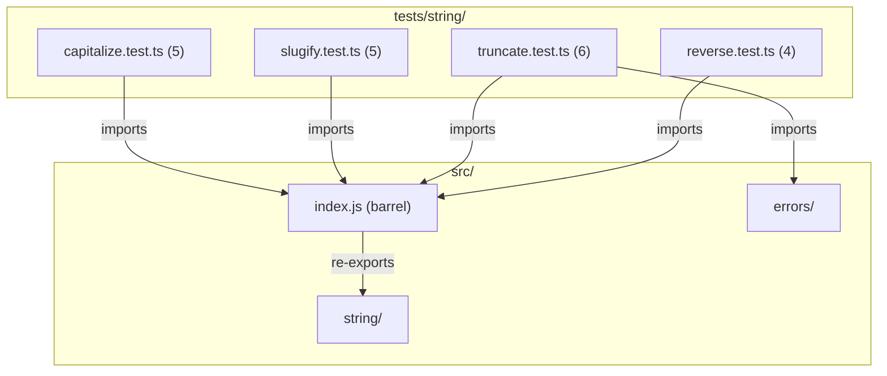

# C4 Code Level: String Utility Tests

## Overview
- **Name**: String Utility Tests
- **Description**: Test suite for string manipulation utility functions
- **Location**: tests/string/
- **Language**: TypeScript (Jest)
- **Purpose**: Validates string transformation, formatting, and error handling for all string utilities
- **Parent Component**: [Primitive Utilities](c4-component-primitives.md)

## Test Inventory

| File | Tests | Description |
|------|-------|-------------|
| capitalize.test.ts | 5 | Tests for `capitalize()` — uppercase first letter |
| slugify.test.ts | 5 | Tests for `slugify()` — URL-safe slug generation |
| truncate.test.ts | 6 | Tests for `truncate()` — truncate with suffix |
| reverse.test.ts | 4 | Tests for `reverse()` — reverse a string |
| **Total** | **20** | |

**Test count: 20 (verified by `npm test`)**

## Code Elements

### Test Suites

- `describe('capitalize', ...)`
  - Location: tests/string/capitalize.test.ts:3
  - Tests: 5 (basic capitalization, empty string, single character, strings with spaces, unicode)
  - Dependencies: `capitalize` from `../../src/index.js`

- `describe('slugify', ...)`
  - Location: tests/string/slugify.test.ts:3
  - Tests: 5 (lowercase with hyphens, removes special chars, collapses spaces/hyphens, trims leading/trailing, empty string)
  - Dependencies: `slugify` from `../../src/index.js`

- `describe('truncate', ...)`
  - Location: tests/string/truncate.test.ts:3
  - Tests: 6 (truncates long strings, returns short unchanged, custom suffix, throws InvalidNumberError for small maxLength, throws EmptyStringError for empty suffix, throws InvalidNumberError for non-positive-integer)
  - Dependencies: `truncate` from `../../src/index.js`, `EmptyStringError`, `InvalidNumberError` from `../../src/errors/index.js`

- `describe('reverse', ...)`
  - Location: tests/string/reverse.test.ts:3
  - Tests: 4 (reverses string, empty string, single character, unicode)
  - Dependencies: `reverse` from `../../src/index.js`

## Dependencies

### Internal Dependencies
- `../../src/index.js` — barrel export providing `capitalize`, `slugify`, `truncate`, `reverse`
- `../../src/errors/index.js` — `EmptyStringError`, `InvalidNumberError`

### External Dependencies
- `jest` — test framework (implicit globals)

## Coverage Summary

Tests cover all 4 string utilities: `capitalize` and `reverse` focus on basic transformations and unicode; `slugify` validates URL-safe slug generation; `truncate` validates both truncation behavior and error handling for invalid parameters.

## Relationships

