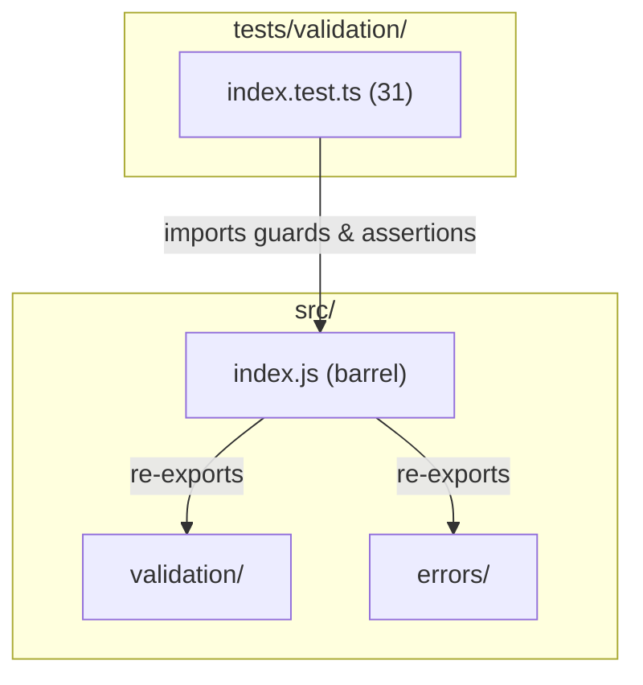

# C4 Code Level: Validation Utility Tests

## Overview
- **Name**: Validation Utility Tests
- **Description**: Test suite for type guard and assertion utility functions
- **Location**: tests/validation/
- **Language**: TypeScript (Jest)
- **Purpose**: Validates type checking, type narrowing, range checking, and assertion behavior for all validation utilities
- **Parent Component**: [Core Infrastructure](c4-component-core.md)

## Test Inventory

| File | Tests | Description |
|------|-------|-------------|
| index.test.ts | 31 | Tests for all validation utilities in a single file |
| **Total** | **31** | |

**Test count: 31 (verified by `npm test`)**

## Code Elements

### Test Suites

- `describe('isNonEmptyString', ...)`
  - Location: tests/validation/index.test.ts:12
  - Tests: 4 (true for non-empty, false for empty, false for non-string, narrows type)
  - Validates: type guard `(value: unknown) => value is string`

- `describe('isPositiveNumber', ...)`
  - Location: tests/validation/index.test.ts:41
  - Tests: 6 (true for positive, false for zero, false for negative, false for non-finite, false for non-number, narrows type)
  - Validates: type guard `(value: unknown) => value is number`

- `describe('isInRange', ...)`
  - Location: tests/validation/index.test.ts:81
  - Tests: 4 (within range, outside range, negative ranges, decimal values)
  - Validates: range checking `(value: number, min: number, max: number) => boolean`

- `describe('isNonNegativeInteger', ...)`
  - Location: tests/validation/index.test.ts:105
  - Tests: 6 (non-negative integers, negative integers, decimals, non-finite, non-number types, narrows type)
  - Validates: type guard `(value: unknown) => value is number`

- `describe('assertNonEmptyString', ...)`
  - Location: tests/validation/index.test.ts:145
  - Tests: 5 (does not throw for non-empty, throws EmptyStringError for empty, throws for non-string, includes field name, narrows type)
  - Validates: assertion function `(value: unknown, field?: string) => asserts value is string`

- `describe('isPlainObject', ...)`
  - Location: tests/validation/index.test.ts:179
  - Tests: 6 (true for plain object, true for Object.create(null), false for null, false for array, false for Date, false for class instance)
  - Validates: type guard `(value: unknown) => value is Record<string, unknown>`

## Dependencies

### Internal Dependencies
- `../../src/index.js` — barrel export providing `isNonEmptyString`, `isPositiveNumber`, `isInRange`, `isNonNegativeInteger`, `assertNonEmptyString`, `isPlainObject`, `EmptyStringError`

### External Dependencies
- `@jest/globals` — `describe`, `expect`, `it` (explicit import)

## Coverage Summary

Tests cover all 6 validation utilities with emphasis on: correct boolean return values for all input types, TypeScript type narrowing (verified at compile time), assertion throwing behavior, boundary conditions (zero, negative, non-finite), and field-level error metadata.

## Relationships

