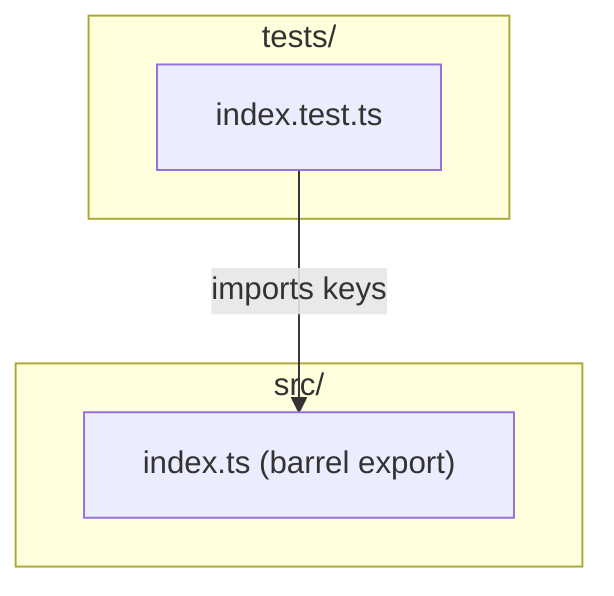

# C4 Code Level: Root Test Suite

## Overview
- **Name**: Root Test Suite
- **Description**: Top-level test verifying the package root index re-exports
- **Location**: tests/
- **Language**: TypeScript (Jest)
- **Purpose**: Validates that the main package entry point correctly re-exports all public utilities
- **Parent Component**: TBD

## Test Inventory

| File | Tests | Description |
|------|-------|-------------|
| index.test.ts | 1 | Verifies root index exports |
| **Total** | **1** | |

**Test count: 1 (verified by `npm test`)**

## Code Elements

### Test Suites

- `describe('root index exports', ...)`
  - Location: tests/index.test.ts:3
  - Tests: 1
  - Validates: `keys` function is exported and callable from `../src/index`

### Test Cases

- `it('exports keys from object module')`
  - Location: tests/index.test.ts:4
  - Asserts: `keys` is a function and returns correct keys from an object

## Dependencies

### Internal Dependencies
- `../src/index` — the package root barrel export

### External Dependencies
- `jest` — test framework (implicit via global `describe`, `it`, `expect`)

## Coverage Summary

Tests verify the root barrel export (`src/index.ts`) re-exports the `keys` function from the object module. This is a smoke test for the package entry point.

## Relationships

