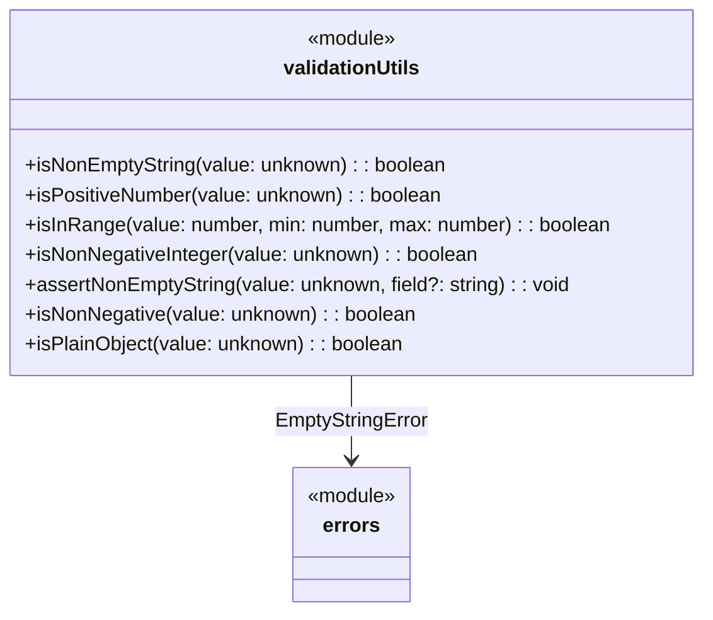

# C4 Code Level: Validation Utilities

## Overview
- **Name**: Validation Utilities
- **Description**: Type guard and assertion functions for input validation
- **Location**: `src/validation`
- **Language**: TypeScript
- **Purpose**: Provides reusable type-narrowing predicates and assertion functions used throughout the library to validate inputs before processing
- **Parent Component**: TBD

## Code Elements

### Functions/Methods

#### `src/validation/index.ts`

- `isNonEmptyString(value: unknown): value is string` — Type guard that returns true if value is a non-empty string

- `isPositiveNumber(value: unknown): value is number` — Type guard that returns true if value is a finite number greater than 0

- `isInRange(value: number, min: number, max: number): boolean` — Returns true if value is within the inclusive range [min, max]

- `isNonNegativeInteger(value: unknown): value is number` — Type guard that returns true if value is a finite non-negative integer

- `assertNonEmptyString(value: unknown, field?: string): asserts value is string` — Assertion function that throws `EmptyStringError` if value is not a non-empty string

- `isNonNegative(value: unknown): value is number` — Type guard that returns true if value is a finite non-negative number

- `isPlainObject(value: unknown): value is Record<string, unknown>` — Type guard that returns true if value is a plain object (prototype is Object.prototype or null, not an array)

## Dependencies

### Internal Dependencies
- `src/errors/index.js` — `EmptyStringError` (used by `assertNonEmptyString`)

### External Dependencies
- None

## Relationships

