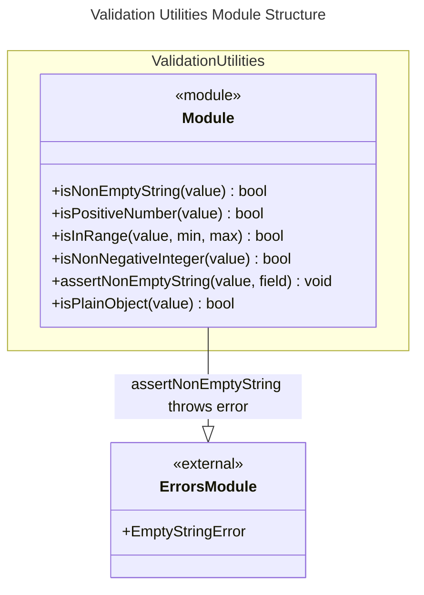

# C4 Code Level: Validation Utilities

## Overview

- **Name**: Validation Utilities Module
- **Description**: A collection of type predicates and assertion functions for runtime validation of values including type checks, range validation, and plain object detection.
- **Location**: src/validation
- **Language**: TypeScript
- **Purpose**: Provides type-safe runtime validation functions with TypeScript type guards for defensive programming and data validation.
- **Parent Component**: [Validation Utilities](./c4-component-validation-utilities.md)

## Code Elements

### Functions/Methods

- `isNonEmptyString(value: unknown): value is string`
  - Description: Type guard predicate that checks if a value is a non-empty string
  - Location: src/validation/index.ts:3
  - Dependencies: none

- `isPositiveNumber(value: unknown): value is number`
  - Description: Type guard predicate that checks if a value is a positive finite number
  - Location: src/validation/index.ts:7
  - Dependencies: none

- `isInRange(value: number, min: number, max: number): boolean`
  - Description: Predicate that checks if a number falls within a specified range (inclusive)
  - Location: src/validation/index.ts:11
  - Dependencies: none

- `isNonNegativeInteger(value: unknown): value is number`
  - Description: Type guard predicate that checks if a value is a non-negative integer
  - Location: src/validation/index.ts:15
  - Dependencies: none

- `assertNonEmptyString(value: unknown, field?: string): asserts value is string`
  - Description: Assertion function that throws EmptyStringError if value is not a non-empty string
  - Location: src/validation/index.ts:22
  - Dependencies: EmptyStringError (src/errors/index.ts)

- `isPlainObject(value: unknown): value is Record<string, unknown>`
  - Description: Type guard predicate that checks if a value is a plain object (not null, not array, prototype is Object.prototype or null)
  - Location: src/validation/index.ts:28
  - Dependencies: none

## Dependencies

### Internal Dependencies

- `src/errors/index.ts` - EmptyStringError used in assertNonEmptyString

### External Dependencies

- Built-in: `Object` global (Object.getPrototypeOf, Object.prototype)
- Built-in: `Number` global (Number.isFinite, Number.isInteger)

## Relationships

## Notes

- All functions except isInRange and assertNonEmptyString are type guard predicates that narrow the type in conditional branches
- Type guard functions use the `value is Type` return annotation to enable TypeScript type narrowing
- isPlainObject correctly distinguishes plain objects from other object types like Date, RegExp, Map, Set by checking prototype chain
- assertNonEmptyString is an assertion function that can be used with TypeScript's assertion signatures to narrow types
- These utilities are commonly used by other modules for parameter validation and data integrity checks
