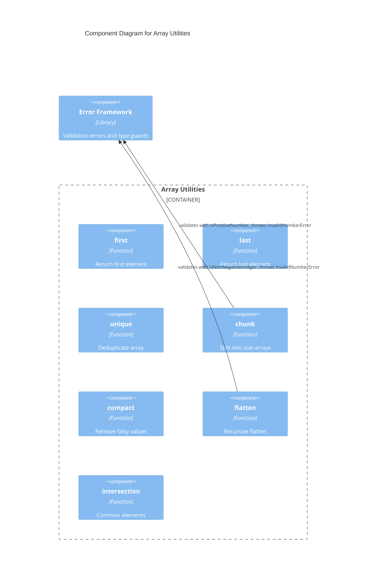

# C4 Component Level: Array Utilities

## Overview
- **Name**: Array Utilities
- **Description**: Provides generic, type-safe array manipulation functions for common operations like chunking, filtering, flattening, and element access.
- **Type**: Library
- **Technology**: TypeScript (with generics)

## Purpose

The Array Utilities component is the largest functional module in the library, offering seven array manipulation functions. These cover element access (first, last), filtering (compact, unique, intersection), restructuring (chunk, flatten), and are implemented with TypeScript generics for type safety.

Functions that accept numeric parameters (chunk size, flatten depth) integrate with both the Error Framework and its validation guards to ensure inputs are valid before processing.

## Software Features
- **Element Access**: Retrieve first or last element with undefined-safe return
- **Deduplication**: Remove duplicates preserving first-occurrence order via Set
- **Chunking**: Split arrays into fixed-size sub-arrays with validated chunk size
- **Compaction**: Remove all falsy values from arrays
- **Flattening**: Recursively flatten nested arrays to configurable depth
- **Intersection**: Find elements common to all input arrays with deduplication

## Code Elements

This component contains:
- [c4-code-array.md](./c4-code-array.md) — Array utility function implementations (first, last, unique, chunk, compact, flatten, intersection)
- [c4-code-tests-array.md](./c4-code-tests-array.md) — Jest test suite with comprehensive edge case coverage for all array functions

## Interfaces

### Array Module API
- **Protocol**: Function calls (ESM exports)
- **Description**: Generic array functions importable from the library root or array sub-module
- **Operations**:
  - `first<T>(arr: T[]): T | undefined` — Return first element
  - `last<T>(arr: T[]): T | undefined` — Return last element
  - `unique<T>(arr: T[]): T[]` — Remove duplicates
  - `chunk<T>(arr: T[], size: number): T[][]` — Split into fixed-size sub-arrays
  - `compact<T>(arr: T[]): T[]` — Remove falsy values
  - `flatten(arr: any[], depth?: number): any[]` — Recursive flatten to depth
  - `intersection<T>(...arrays: T[][]): T[]` — Elements common to all arrays

## Dependencies

### Components Used
- **Error Framework**: `chunk` and `flatten` throw `InvalidNumberError`; `chunk` uses `isPositiveNumber` and `flatten` uses `isNonNegativeInteger` validation guards

### External Systems
- None

## Component Diagram

