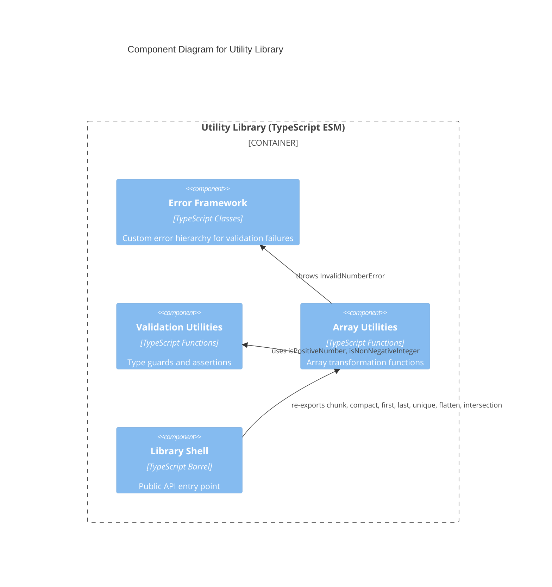

# C4 Component Level: Array Utilities

## Overview

- **Name**: Array Utilities
- **Description**: Type-safe array transformation and set-operation utilities covering chunking, compaction, element access, deduplication, flattening, and intersection.
- **Type**: Library
- **Technology**: TypeScript 5.x (ESM)

## Purpose

The Array Utilities component provides seven general-purpose array functions that cover the most common array transformation and set-operation needs. All functions are generic (`<T>`) where applicable, preserving element type information through TypeScript's type system so callers benefit from full type inference.

Two functions — `chunk` and `flatten` — perform parameter validation and use both the Error Framework and Validation Utilities. `chunk` delegates size validation to `isPositiveNumber` and throws `InvalidNumberError` for invalid chunk sizes. `flatten` delegates depth validation to `isNonNegativeInteger` with the same error type. The remaining five functions (`compact`, `first`, `last`, `unique`, `intersection`) are pure and have no dependencies.

The component depends on the Error Framework and Validation Utilities, placing it above those two foundation components in the dependency order.

## Software Features

- **Chunking**: `chunk` splits an array into equal-sized sub-arrays, with validated chunk size
- **Compaction**: `compact` removes all falsy values (`false`, `null`, `0`, `""`, `undefined`, `NaN`) from an array
- **Element access**: `first` and `last` return the first or last element, or `undefined` for empty arrays
- **Deduplication**: `unique` removes duplicate elements using Set semantics, preserving first-occurrence order
- **Recursive flattening**: `flatten` recursively flattens nested arrays to a specified depth (default 1; accepts `Infinity`)
- **Set intersection**: `intersection` returns elements present in all provided arrays with automatic deduplication

## Code Elements

This component contains:

- [c4-code-array.md](./c4-code-array.md) — Array transformation and set-operation functions (`chunk`, `compact`, `first`, `last`, `unique`, `flatten`, `intersection`) at `src/array/`

## Interfaces

### Array Transformation Functions (Function calls)

- **Protocol**: TypeScript function calls (synchronous, pure)
- **Description**: Generic array utility functions
- **Operations**:
  - `chunk<T>(arr: T[], size: number): T[][]` — Splits array into chunks; throws `InvalidNumberError` if size is not a positive integer
  - `compact<T>(arr: T[]): T[]` — Removes falsy values; returns new array
  - `first<T>(arr: T[]): T | undefined` — Returns first element or `undefined`
  - `last<T>(arr: T[]): T | undefined` — Returns last element or `undefined`
  - `unique<T>(arr: T[]): T[]` — Removes duplicates, preserving first-occurrence order
  - `flatten(arr: any[], depth?: number): any[]` — Flattens to given depth; throws `InvalidNumberError` if depth is negative or non-integer
  - `intersection<T>(...arrays: T[][]): T[]` — Returns elements common to all arrays, deduplicated

## Dependencies

### Components Used

- **Error Framework**: `InvalidNumberError` thrown by `chunk` and `flatten` for invalid parameters
- **Validation Utilities**: `isPositiveNumber` used by `chunk`; `isNonNegativeInteger` used by `flatten`

### External Systems

- TypeScript 5.x — Generic type parameters, type system
- ES2015+ — Native `Set`, `Array.prototype.filter`, `Array.prototype.slice`, `Array.prototype.reduce`, `Array.prototype.concat`, `Array.prototype.includes`

## Component Diagram

```mermaid
C4Component
    title Component Diagram for Utility Library

    Container_Boundary(lib, "Utility Library (TypeScript ESM)") {
        Component(errors, "Error Framework", "TypeScript Classes", "Custom error hierarchy for validation failures")
        Component(validation, "Validation Utilities", "TypeScript Functions", "Type guards and assertions")
        Component(array, "Array Utilities", "TypeScript Functions", "Array transformation functions")
        Component(shell, "Library Shell", "TypeScript Barrel", "Public API entry point")
    }

    Rel(array, errors, "throws InvalidNumberError")
    Rel(array, validation, "uses isPositiveNumber, isNonNegativeInteger")
    Rel(shell, array, "re-exports chunk, compact, first, last, unique, flatten, intersection")
```
