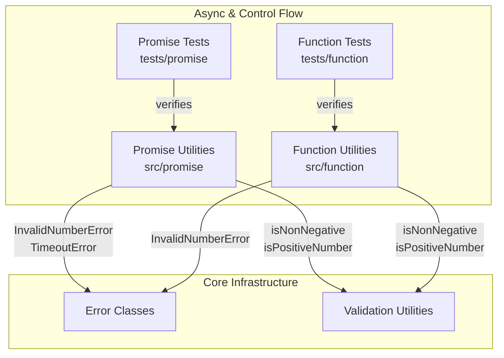

# C4 Component: Async & Control Flow

## Overview

The Async & Control Flow component provides utilities for controlling the timing and execution of functions and promises. It includes async helpers (sleep, retry, timeout) and higher-order function wrappers (once, debounce, throttle).

## Purpose

Offers execution control patterns: delaying execution, retrying failed async operations, adding timeouts to promises, single-execution caching, call debouncing, and rate-limiting. These utilities wrap existing functions to modify their execution behavior.

## Software Features

- **Promise Delay**: Sleep/delay via promise-based timer
- **Retry Logic**: Retry failed async operations with configurable attempt count
- **Timeout Control**: Race a promise against a deadline, rejecting with TimeoutError
- **Single Execution**: Cache first invocation result, ignore subsequent calls
- **Debouncing**: Coalesce rapid calls, executing only after a quiet period
- **Throttling**: Rate-limit execution to at most once per time window

## Code Elements

| Code Element | Location | Description |
|---|---|---|
| [Promise Utilities](c4-code-promise.md) | `src/promise` | 3 async functions: sleep, retry, timeout |
| [Function Utilities](c4-code-function.md) | `src/function` | 3 higher-order functions: once, debounce, throttle |
| [Promise Utility Tests](c4-code-tests-promise.md) | `tests/promise` | 31 tests across 3 test suites |
| [Function Utility Tests](c4-code-tests-function.md) | `tests/function` | 30 tests across 3 test suites |

## Interfaces

### Promise Functions (`src/promise`)

```typescript
function sleep(ms: number): Promise<void>;
function retry<T>(fn: () => Promise<T>, attempts: number): Promise<T>;
function timeout<T>(promise: Promise<T>, ms: number): Promise<T>;
```

### Function Wrappers (`src/function`)

```typescript
function once<T extends (...args: any[]) => any>(fn: T): T;
function debounce<T extends (...args: any[]) => any>(fn: T, ms: number): T;
function throttle<T extends (...args: any[]) => any>(fn: T, ms: number): T;
```

## Dependencies

### Internal Dependencies
- promise → errors: `InvalidNumberError`, `TimeoutError` (used by sleep, retry, timeout)
- promise → validation: `isNonNegative`, `isPositiveNumber` (used by sleep, retry, timeout)
- function → errors: `InvalidNumberError` (used by debounce, throttle)
- function → validation: `isNonNegative`, `isPositiveNumber` (used by debounce, throttle)

### External Dependencies
- None

## Component Diagram


