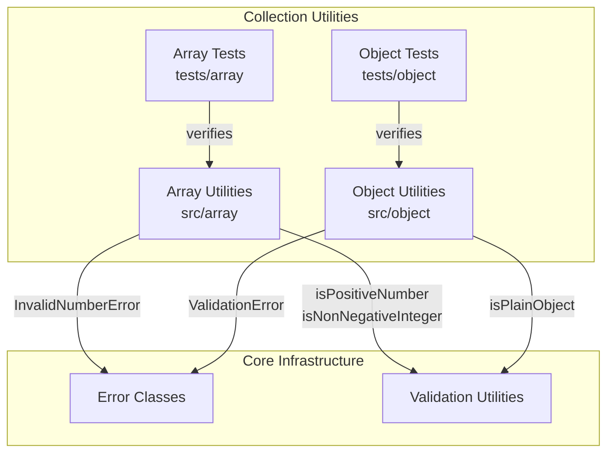

# C4 Component: Collection Utilities

## Overview

The Collection Utilities component provides manipulation and introspection functions for arrays and objects. These are generic, type-safe functions that operate on collection data structures.

## Purpose

Offers commonly-needed operations on collections: array element access, deduplication, chunking, compacting, flattening, and intersection for arrays; deep cloning, merging, property selection/exclusion, nested access, and emptiness checking for objects.

## Software Features

- **Array Access**: First/last element retrieval with type-safe generics
- **Array Transformation**: Deduplication, chunking, compacting falsy values, depth-controlled flattening, multi-array intersection
- **Object Manipulation**: Deep clone (structuredClone), deep merge with recursive strategy, property pick/omit
- **Object Introspection**: Dot-path nested access, emptiness checking, typed key extraction
- **Type Safety**: Generic type parameters preserve input types through transformations

## Code Elements

| Code Element | Location | Description |
|---|---|---|
| [Array Utilities](c4-code-array.md) | `src/array` | 7 array functions: first, last, unique, chunk, compact, flatten, intersection |
| [Object Utilities](c4-code-object.md) | `src/object` | 7 object functions: clone, get, isEmpty, keys, merge, omit, pick |
| [Array Utility Tests](c4-code-tests-array.md) | `tests/array` | 60 tests across 7 test suites |
| [Object Utility Tests](c4-code-tests-object.md) | `tests/object` | 87 tests across 7 test suites |

## Interfaces

### Array Functions (`src/array`)

```typescript
function first<T>(arr: T[]): T | undefined;
function last<T>(arr: T[]): T | undefined;
function unique<T>(arr: T[]): T[];
function chunk<T>(arr: T[], size: number): T[][];
function compact<T>(arr: T[]): T[];
function flatten(arr: any[], depth?: number): any[];
function intersection<T>(...arrays: T[][]): T[];
```

### Object Functions (`src/object`)

```typescript
function clone<T>(obj: T): T;
function get(obj: unknown, path: string, defaultValue?: unknown): unknown;
function isEmpty(value: unknown): boolean;
function keys<T extends object>(obj: T): (keyof T)[];
function merge<T extends Record<string, unknown>>(target: T, ...sources: Partial<T>[]): T;
function omit<T extends Record<string, unknown>, K extends keyof T>(obj: T, keys: K[]): Omit<T, K>;
function pick<T extends Record<string, unknown>, K extends keyof T>(obj: T, keys: K[]): Pick<T, K>;
```

## Dependencies

### Internal Dependencies
- array → errors: `InvalidNumberError` (used by `chunk`, `flatten`)
- array → validation: `isPositiveNumber`, `isNonNegativeInteger` (used by `chunk`, `flatten`)
- object → errors: `ValidationError` (used by `clone`)
- object → validation: `isPlainObject` (used by `merge`)

### External Dependencies
- None

## Component Diagram


