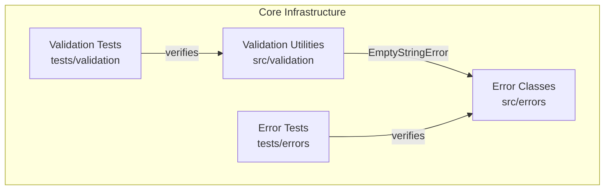

# C4 Component: Core Infrastructure

## Overview

The Core Infrastructure component provides the foundational error hierarchy and validation utilities used throughout the library. All other components depend on this component for input validation and structured error reporting.

## Purpose

Establishes a consistent error handling and input validation layer. Custom error classes provide typed, structured exceptions with optional field metadata. Validation utilities offer reusable type guards and assertion functions that narrow TypeScript types and validate inputs before processing.

## Software Features

- **Structured Error Hierarchy**: Custom error classes extending `Error` with typed names and optional field context
- **Type Guard Functions**: Runtime type-narrowing predicates for strings, numbers, integers, ranges, and plain objects
- **Assertion Functions**: Functions that throw typed errors on validation failure, enabling TypeScript type narrowing
- **Input Validation**: Reusable validation logic consumed by all utility modules

## Code Elements

| Code Element | Location | Description |
|---|---|---|
| [Error Classes](c4-code-errors.md) | `src/errors` | Custom error class hierarchy (ValidationError, EmptyStringError, InvalidNumberError, OutOfRangeError, TimeoutError) |
| [Validation Utilities](c4-code-validation.md) | `src/validation` | Type guards and assertion functions for input validation |
| [Error Class Tests](c4-code-tests-errors.md) | `tests/errors` | 13 tests validating error instantiation, inheritance, and formatting |
| [Validation Utility Tests](c4-code-tests-validation.md) | `tests/validation` | 31 tests validating type guards, assertions, and type narrowing |

## Interfaces

### Error Classes (`src/errors`)

```typescript
class ValidationError extends Error {
  constructor(message: string, field?: string);
  readonly field?: string;
}
class EmptyStringError extends ValidationError {
  constructor(field?: string);
}
class InvalidNumberError extends ValidationError {
  constructor(message: string, field?: string);
}
class OutOfRangeError extends ValidationError {
  constructor(value: number, min: number, max: number, field?: string);
}
class TimeoutError extends ValidationError {
  constructor(ms: number);
}
```

### Validation Functions (`src/validation`)

```typescript
function isNonEmptyString(value: unknown): value is string;
function isPositiveNumber(value: unknown): value is number;
function isInRange(value: number, min: number, max: number): boolean;
function isNonNegativeInteger(value: unknown): value is number;
function isNonNegative(value: unknown): value is number;
function isPlainObject(value: unknown): value is Record<string, unknown>;
function assertNonEmptyString(value: unknown, field?: string): asserts value is string;
```

## Dependencies

### Internal Dependencies
- validation → errors: `EmptyStringError` (used by `assertNonEmptyString`)

### External Dependencies
- None

## Component Diagram


