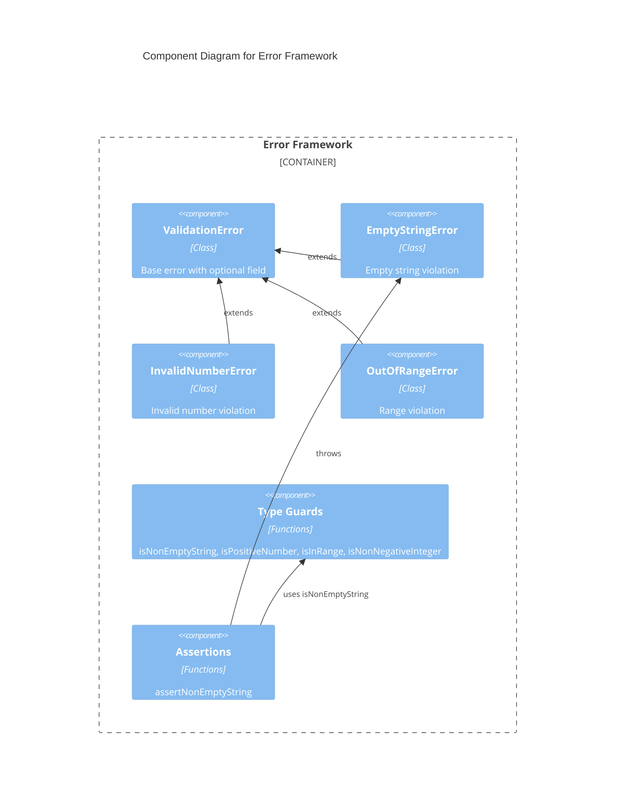

# C4 Component Level: Error Framework

## Overview
- **Name**: Error Framework
- **Description**: Cross-cutting error hierarchy and validation utilities providing typed error classes and runtime type guards for the entire library.
- **Type**: Library (Cross-cutting)
- **Technology**: TypeScript

## Purpose

The Error Framework component provides the foundational error handling and input validation infrastructure used by all other components in the library. It consists of two tightly coupled sub-modules: a custom error class hierarchy and a set of type guard/assertion functions.

The error classes extend the native Error with a `field` property for identifying which input caused the failure, and subclasses for specific failure types (empty strings, invalid numbers, out-of-range values). The validation utilities provide TypeScript type guards that narrow types at runtime and assertion functions that throw the appropriate error types.

These two sub-modules are grouped into a single component because they have a direct dependency (validation throws error classes) and change together when new validation concerns are added.

## Software Features
- **Error Hierarchy**: ValidationError base class with EmptyStringError, InvalidNumberError, OutOfRangeError subclasses
- **Field Tracking**: Optional field name on all validation errors for precise error reporting
- **Type Guards**: Runtime type narrowing functions (isNonEmptyString, isPositiveNumber, isInRange, isNonNegativeInteger)
- **Assertions**: Throwing assertion functions that narrow types on success (assertNonEmptyString)

## Code Elements

This component contains:
- [c4-code-errors.md](./c4-code-errors.md) — Custom error class hierarchy (ValidationError, EmptyStringError, InvalidNumberError, OutOfRangeError)
- [c4-code-validation.md](./c4-code-validation.md) — Type guard and assertion functions for runtime validation
- [c4-code-tests-errors.md](./c4-code-tests-errors.md) — Test suite for error class construction, inheritance, and field handling
- [c4-code-tests-validation.md](./c4-code-tests-validation.md) — Test suite for all type guards and assertion functions

## Interfaces

### Error Classes
- **Protocol**: Class instantiation / throw
- **Description**: Typed error classes for structured error handling
- **Operations**:
  - `new ValidationError(message: string, field?: string)` — Base validation error
  - `new EmptyStringError(field?: string)` — Empty string violation
  - `new InvalidNumberError(message: string, field?: string)` — Invalid number violation
  - `new OutOfRangeError(value: number, min: number, max: number, field?: string)` — Range violation

### Validation Guards
- **Protocol**: Function calls (ESM exports)
- **Description**: Runtime type guards and assertion functions
- **Operations**:
  - `isNonEmptyString(value: unknown): value is string` — Non-empty string guard
  - `isPositiveNumber(value: unknown): value is number` — Positive finite number guard
  - `isInRange(value: number, min: number, max: number): boolean` — Inclusive range check
  - `isNonNegativeInteger(value: unknown): value is number` — Non-negative integer guard
  - `assertNonEmptyString(value: unknown, field?: string): asserts value is string` — Throws EmptyStringError if not valid

## Dependencies

### Components Used
- None (this is the foundational component — all others depend on it)

### External Systems
- None

## Component Diagram

