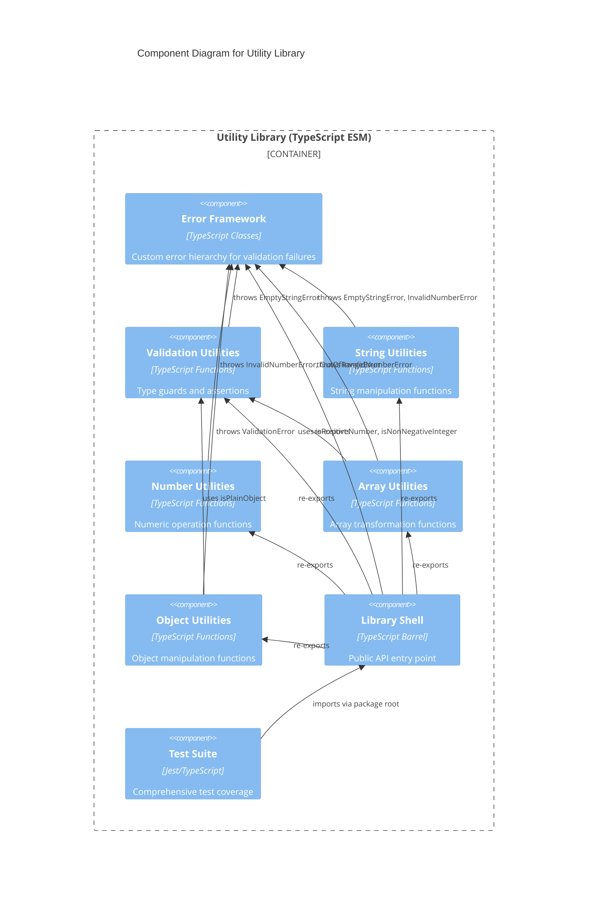

# C4 Component Level: Error Framework

## Overview

- **Name**: Error Framework
- **Description**: Custom error class hierarchy providing domain-specific exceptions for all validation failures across the library.
- **Type**: Library
- **Technology**: TypeScript 5.x (ESM)

## Purpose

The Error Framework defines the exception types used throughout the utility library to communicate validation failures back to callers. It establishes a consistent, structured approach to error signaling by extending the native `Error` class with domain-specific subclasses that carry contextual information (such as the field name that caused the failure).

This component is foundational to the entire library. Every module that performs input validation — Array Utilities, Number Utilities, String Utilities, Validation Utilities, and Object Utilities — imports from this component to throw meaningful, catchable errors. Callers can use `instanceof` to distinguish between error types and inspect the `field` property to understand which parameter was invalid.

The component has no internal dependencies, making it safe to import from any other component without risk of circular dependencies.

## Software Features

- **Base validation error**: `ValidationError` base class with optional `field` context, extending the native `Error` class
- **Empty string signaling**: `EmptyStringError` subclass with a fixed "String cannot be empty" message, for string validation failures
- **Invalid number signaling**: `InvalidNumberError` subclass with a configurable message, for numeric parameter validation failures
- **Out-of-range signaling**: `OutOfRangeError` subclass that auto-formats a "[min, max]" range message, for range constraint violations
- **Full instanceof chain**: All subclasses pass `instanceof ValidationError` and `instanceof Error` checks, enabling broad catch clauses

## Code Elements

This component contains:

- [c4-code-errors.md](./c4-code-errors.md) — Custom error class hierarchy (`ValidationError`, `EmptyStringError`, `InvalidNumberError`, `OutOfRangeError`) at `src/errors/`

## Interfaces

### Error Classes (TypeScript class instantiation)

- **Protocol**: TypeScript class instantiation / `throw` / `catch`
- **Description**: Four typed error classes that extend `Error`, thrown by validators and caught by callers
- **Operations**:
  - `new ValidationError(message: string, field?: string): ValidationError` — Base error with optional field name
  - `new EmptyStringError(field?: string): EmptyStringError` — Fixed-message error for empty strings
  - `new InvalidNumberError(message: string, field?: string): InvalidNumberError` — Error for invalid numeric parameters
  - `new OutOfRangeError(value: number, min: number, max: number, field?: string): OutOfRangeError` — Error for range violations with auto-formatted message

## Dependencies

### Components Used

None. This component has no internal dependencies.

### External Systems

- TypeScript 5.x — Class syntax, type system
- ES2015+ — Native `Error` class inheritance

## Component Diagram

```mermaid
C4Component
    title Component Diagram for Utility Library

    Container_Boundary(lib, "Utility Library (TypeScript ESM)") {
        Component(errors, "Error Framework", "TypeScript Classes", "Custom error hierarchy for validation failures")
        Component(validation, "Validation Utilities", "TypeScript Functions", "Type guards and assertions")
        Component(string, "String Utilities", "TypeScript Functions", "String manipulation functions")
        Component(number, "Number Utilities", "TypeScript Functions", "Numeric operation functions")
        Component(array, "Array Utilities", "TypeScript Functions", "Array transformation functions")
        Component(object, "Object Utilities", "TypeScript Functions", "Object manipulation functions")
        Component(shell, "Library Shell", "TypeScript Barrel", "Public API entry point")
        Component(tests, "Test Suite", "Jest/TypeScript", "Comprehensive test coverage")
    }

    Rel(validation, errors, "throws EmptyStringError")
    Rel(string, errors, "throws EmptyStringError, InvalidNumberError")
    Rel(number, errors, "throws InvalidNumberError, OutOfRangeError")
    Rel(array, errors, "throws InvalidNumberError")
    Rel(object, errors, "throws ValidationError")
    Rel(array, validation, "uses isPositiveNumber, isNonNegativeInteger")
    Rel(object, validation, "uses isPlainObject")
    Rel(shell, errors, "re-exports")
    Rel(shell, validation, "re-exports")
    Rel(shell, string, "re-exports")
    Rel(shell, number, "re-exports")
    Rel(shell, array, "re-exports")
    Rel(shell, object, "re-exports")
    Rel(tests, shell, "imports via package root")
```
