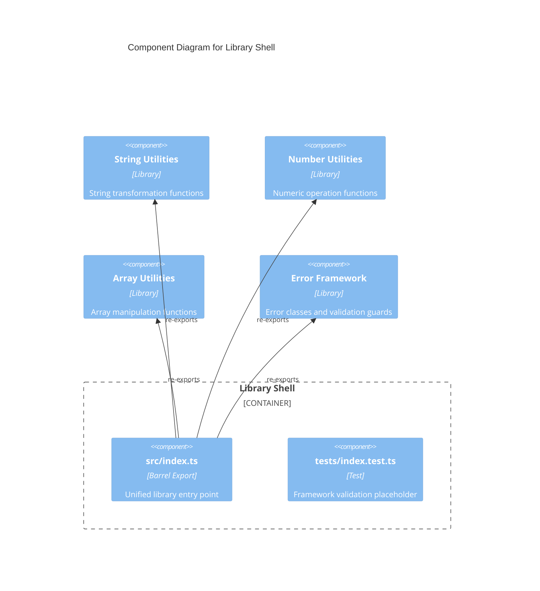

# C4 Component Level: Library Shell

## Overview
- **Name**: Library Shell
- **Description**: Entry point and packaging layer that aggregates all modules into the library's public API.
- **Type**: Application Shell
- **Technology**: TypeScript (ESM barrel exports)

## Purpose

The Library Shell component serves as the packaging and distribution layer for the utility library. It consists of the root barrel export file (`src/index.ts`) that re-exports every public function and class from all sub-modules, providing consumers with a single import path.

It also includes the root test infrastructure placeholder that validates the Jest test framework configuration is operational.

## Software Features
- **Unified API Surface**: Single import path for all library exports
- **Module Aggregation**: Re-exports from string, number, array, errors, and validation modules
- **Test Infrastructure**: Placeholder test validating Jest configuration

## Code Elements

This component contains:
- [c4-code-src.md](./c4-code-src.md) — Root barrel export aggregating all module APIs
- [c4-code-tests.md](./c4-code-tests.md) — Root test placeholder validating test framework setup

## Interfaces

### Library Root API
- **Protocol**: ESM module exports
- **Description**: Re-exports the complete public API of all components
- **Operations**:
  - All String Utilities operations (capitalize, reverse, slugify, truncate)
  - All Number Utilities operations (clamp, roundTo)
  - All Array Utilities operations (first, last, unique, chunk, compact, flatten, intersection)
  - All Error Framework classes (ValidationError, EmptyStringError, InvalidNumberError, OutOfRangeError)
  - All Validation guards (isNonEmptyString, isPositiveNumber, isInRange, isNonNegativeInteger, assertNonEmptyString)

## Dependencies

### Components Used
- **String Utilities**: Re-exports all string functions
- **Number Utilities**: Re-exports all number functions
- **Array Utilities**: Re-exports all array functions
- **Error Framework**: Re-exports all error classes and validation guards

### External Systems
- None

## Component Diagram

